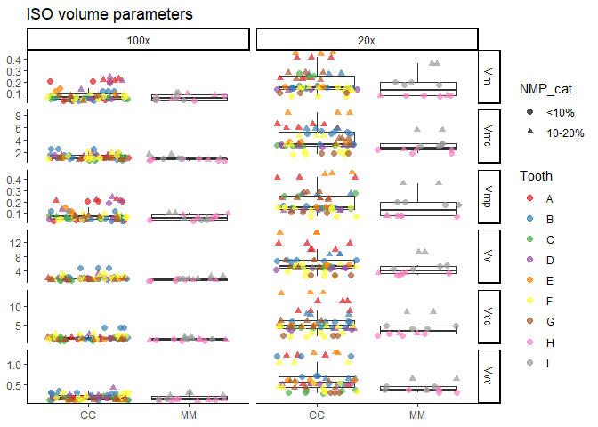
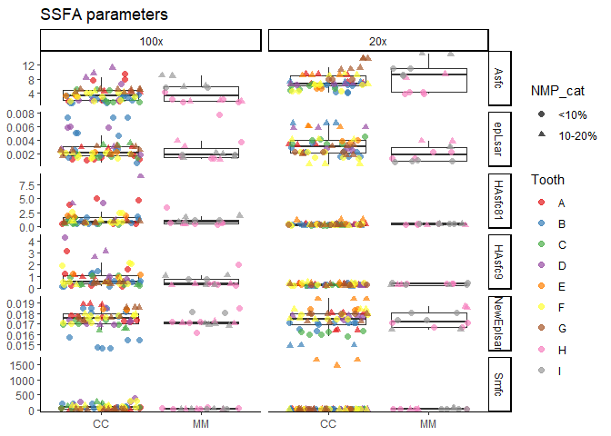
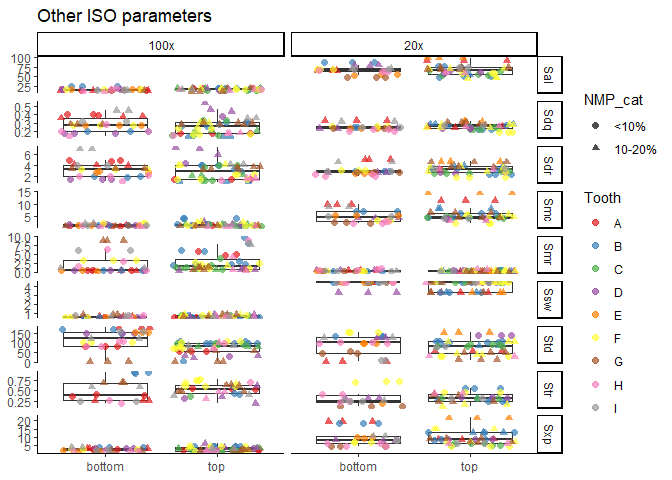
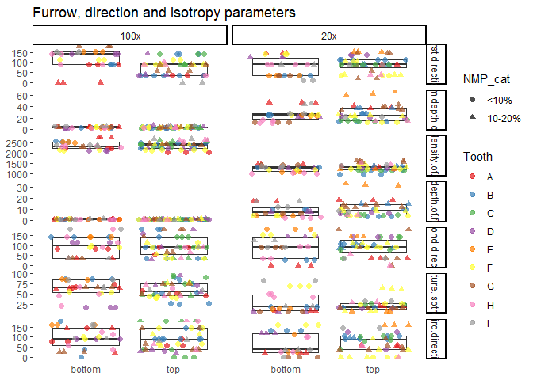
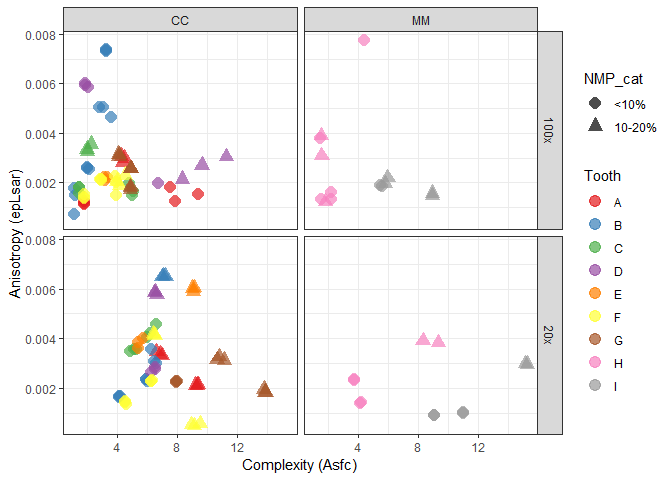
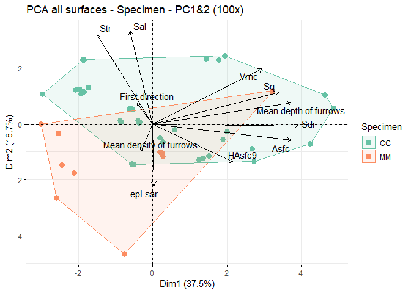
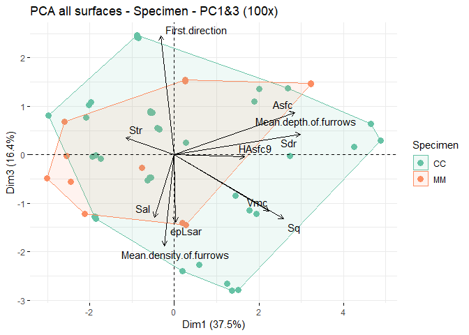
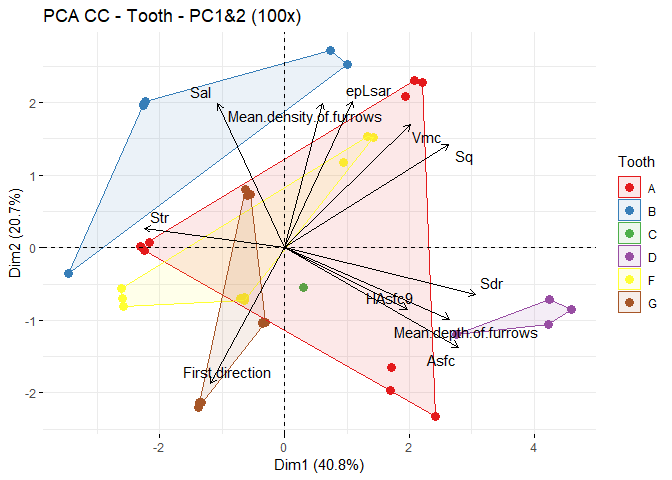
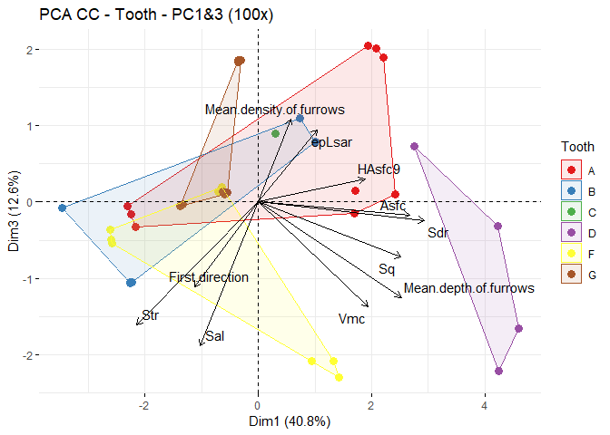

Plots for the dataset of DMTA on Devionan sharks
================
Ivan Calandra
2023-09-07 11:04:45 CEST

- [Goal of the script](#goal-of-the-script)
- [Load packages](#load-packages)
- [Read in data](#read-in-data)
  - [Get name and path of input file](#get-name-and-path-of-input-file)
  - [Read in Rbin file](#read-in-rbin-file)
- [Exclude surfaces with NMP ≥ 20%](#exclude-surfaces-with-nmp--20)
- [Plot each surface parameter in a
  boxplot](#plot-each-surface-parameter-in-a-boxplot)
  - [Define variables](#define-variables)
  - [Plotting function](#plotting-function)
  - [Plot with Specimen as grouping
    variable](#plot-with-specimen-as-grouping-variable)
    - [ISO 25178 height parameters](#iso-25178-height-parameters)
    - [ISO 25178 volume parameters](#iso-25178-volume-parameters)
    - [Other ISO 25178 parameters](#other-iso-25178-parameters)
    - [Furrow, direction and isotropy
      parameters](#furrow-direction-and-isotropy-parameters)
    - [SSFA parameters](#ssfa-parameters)
    - [Save plots](#save-plots)
  - [Plot with Position as grouping
    variable](#plot-with-position-as-grouping-variable)
    - [ISO 25178 height parameters](#iso-25178-height-parameters-1)
    - [ISO 25178 volume parameters](#iso-25178-volume-parameters-1)
    - [Other ISO 25178 parameters](#other-iso-25178-parameters-1)
    - [Furrow, direction and isotropy
      parameters](#furrow-direction-and-isotropy-parameters-1)
    - [SSFA parameters](#ssfa-parameters-1)
    - [Save plots](#save-plots-1)
- [Plot anisotropy vs. complexity](#plot-anisotropy-vs-complexity)
  - [Facetting around Specimen](#facetting-around-specimen)
  - [Facetting around Position](#facetting-around-position)
  - [Save plots](#save-plots-2)
- [PCA](#pca)
  - [Prepare data and select
    parameters](#prepare-data-and-select-parameters)
  - [Run PCAs](#run-pcas)
    - [PCA on all surfaces](#pca-on-all-surfaces)
    - [PCA on Specimen CC](#pca-on-specimen-cc)
  - [Plots](#plots)
    - [Eigenvalues](#eigenvalues)
      - [On all surfaces](#on-all-surfaces)
      - [On Specimen CC](#on-specimen-cc)
    - [Biplots](#biplots)
      - [Plotting function](#plotting-function-1)
      - [On all surfaces with grouping from Specimen (CC
        vs. MM)](#on-all-surfaces-with-grouping-from-specimen-cc-vs-mm)
      - [On all surfaces with grouping from Position (bottom
        vs. top)](#on-all-surfaces-with-grouping-from-position-bottom-vs-top)
      - [On Specimen CC with grouping from
        Tooth](#on-specimen-cc-with-grouping-from-tooth)
    - [Save plots](#save-plots-3)
- [sessionInfo()](#sessioninfo)
- [Cite R packages used](#cite-r-packages-used)
  - [References](#references)

------------------------------------------------------------------------

# Goal of the script

The script plots all SSFA variables for the Devonian shark dataset.

``` r
dir_in  <- "analysis/derived_data"
dir_out <- "analysis/plots"
```

Input Rbin data file must be located in “./analysis/derived_data”.  
Plots will be saved in “./analysis/plots”.

The knit directory for this script is the project directory.

------------------------------------------------------------------------

# Load packages

``` r
pack_to_load <- sort(c("R.utils", "tidyverse", "factoextra", "ggplot2", "ggpubr", "RColorBrewer", 
                       "knitr", "rmarkdown", "grateful"))
sapply(pack_to_load, library, character.only = TRUE, logical.return = TRUE)
```

      factoextra      ggplot2       ggpubr     grateful        knitr      R.utils 
            TRUE         TRUE         TRUE         TRUE         TRUE         TRUE 
    RColorBrewer    rmarkdown    tidyverse 
            TRUE         TRUE         TRUE 

------------------------------------------------------------------------

# Read in data

## Get name and path of input file

``` r
info_in <- list.files(dir_in, pattern = "\\.Rbin$", full.names = TRUE)
info_in
```

    [1] "analysis/derived_data/DMTA-Ctenacanths.Rbin"

## Read in Rbin file

``` r
sharks <- loadObject(info_in)
str(sharks)
```

    'data.frame':   160 obs. of  43 variables:
     $ Specimen                : chr  "CC" "CC" "CC" "CC" ...
     $ Tooth                   : chr  "A" "A" "A" "A" ...
     $ Location                : chr  "loc1" "loc1" "loc1" "loc1" ...
     $ Objective               : chr  "100x" "100x" "100x" "20x" ...
     $ Measurement             : chr  "meas1" "meas2" "meas3" "meas1" ...
     $ Position                : chr  "top" "top" "top" "top" ...
     $ NMP                     : num  3.03 3.05 3.34 12.54 11.63 ...
     $ NMP_cat                 : Ord.factor w/ 3 levels "<10%"<"10-20%"<..: 1 1 1 2 2 2 1 1 1 3 ...
     $ Sq                      : num  1.22 1.18 1.16 7.28 7.29 ...
     $ Ssk                     : num  -0.332 -0.345 -0.355 0.83 0.814 ...
     $ Sku                     : num  2.53 2.45 2.42 3.15 3.14 ...
     $ Sp                      : num  2.74 2.73 2.69 22.04 22.01 ...
     $ Sv                      : num  3.42 3.25 3.17 17.88 19.03 ...
     $ Sz                      : num  6.16 5.98 5.86 39.92 41.04 ...
     $ Sa                      : num  0.995 0.969 0.956 5.8 5.803 ...
     $ Smr                     : num  5.865 4.991 4.781 0.189 0.183 ...
     $ Smc                     : num  1.5 1.47 1.43 11.42 11.45 ...
     $ Sxp                     : num  2.62 2.5 2.48 8.72 8.84 ...
     $ Sal                     : num  20.7 20.4 20.3 91.8 91.5 ...
     $ Str                     : num  0.557 0.53 0.537 NA NA ...
     $ Std                     : num  58.5 58.5 58.5 58.5 58.7 ...
     $ Ssw                     : num  0.658 0.658 0.658 3.295 3.295 ...
     $ Sdq                     : num  0.179 0.176 0.176 0.252 0.257 ...
     $ Sdr                     : num  1.51 1.47 1.46 2.97 3.08 ...
     $ Vm                      : num  0.0382 0.033 0.032 0.4189 0.414 ...
     $ Vv                      : num  1.54 1.5 1.47 11.84 11.86 ...
     $ Vmp                     : num  0.0382 0.033 0.032 0.4189 0.414 ...
     $ Vmc                     : num  1.21 1.18 1.15 5.85 5.88 ...
     $ Vvc                     : num  1.39 1.35 1.32 11.35 11.37 ...
     $ Vvv                     : num  0.148 0.148 0.147 0.487 0.496 ...
     $ Maximum.depth.of.furrows: num  2.33 2.29 2.29 41.48 39.05 ...
     $ Mean.depth.of.furrows   : num  0.834 0.808 0.792 18.822 18.342 ...
     $ Mean.density.of.furrows : num  2027 2022 2034 1354 1319 ...
     $ First.direction         : num  37 37 37 90 90 ...
     $ Second.direction        : num  56.5 90 90 37 37 ...
     $ Third.direction         : num  90 56.6 56.6 56.5 56.5 ...
     $ Texture.isotropy        : num  47.3 51.9 58.7 21 21 ...
     $ epLsar                  : num  0.00119 0.00113 0.00124 0.00347 0.00337 ...
     $ NewEplsar               : num  0.0172 0.0172 0.0173 0.0163 0.0164 ...
     $ Asfc                    : num  1.85 1.79 1.82 6.64 6.88 ...
     $ Smfc                    : num  86.2 48.8 52 12.9 12.9 ...
     $ HAsfc9                  : num  0.249 0.233 0.172 0.364 0.363 ...
     $ HAsfc81                 : num  0.591 0.582 0.516 0.486 0.459 ...
     - attr(*, "comment")= Named chr [1:36] "%" "µm" "<no unit>" "<no unit>" ...
      ..- attr(*, "names")= chr [1:36] "NMP" "Sq" "Ssk" "Sku" ...

------------------------------------------------------------------------

# Exclude surfaces with NMP ≥ 20%

Surfaces with more than 20% NMP should not be analyzed.

``` r
sharks_nmp0_20 <- filter(sharks, NMP_cat != "≥20%")
sharks_nmp0_20$NMP_cat <- factor(sharks_nmp0_20$NMP_cat)
str(sharks_nmp0_20)
```

    'data.frame':   144 obs. of  43 variables:
     $ Specimen                : chr  "CC" "CC" "CC" "CC" ...
     $ Tooth                   : chr  "A" "A" "A" "A" ...
     $ Location                : chr  "loc1" "loc1" "loc1" "loc1" ...
     $ Objective               : chr  "100x" "100x" "100x" "20x" ...
     $ Measurement             : chr  "meas1" "meas2" "meas3" "meas1" ...
     $ Position                : chr  "top" "top" "top" "top" ...
     $ NMP                     : num  3.03 3.05 3.34 12.54 11.63 ...
     $ NMP_cat                 : Ord.factor w/ 2 levels "<10%"<"10-20%": 1 1 1 2 2 2 1 1 1 2 ...
     $ Sq                      : num  1.22 1.18 1.16 7.28 7.29 ...
     $ Ssk                     : num  -0.332 -0.345 -0.355 0.83 0.814 ...
     $ Sku                     : num  2.53 2.45 2.42 3.15 3.14 ...
     $ Sp                      : num  2.74 2.73 2.69 22.04 22.01 ...
     $ Sv                      : num  3.42 3.25 3.17 17.88 19.03 ...
     $ Sz                      : num  6.16 5.98 5.86 39.92 41.04 ...
     $ Sa                      : num  0.995 0.969 0.956 5.8 5.803 ...
     $ Smr                     : num  5.865 4.991 4.781 0.189 0.183 ...
     $ Smc                     : num  1.5 1.47 1.43 11.42 11.45 ...
     $ Sxp                     : num  2.62 2.5 2.48 8.72 8.84 ...
     $ Sal                     : num  20.7 20.4 20.3 91.8 91.5 ...
     $ Str                     : num  0.557 0.53 0.537 NA NA ...
     $ Std                     : num  58.5 58.5 58.5 58.5 58.7 ...
     $ Ssw                     : num  0.658 0.658 0.658 3.295 3.295 ...
     $ Sdq                     : num  0.179 0.176 0.176 0.252 0.257 ...
     $ Sdr                     : num  1.51 1.47 1.46 2.97 3.08 ...
     $ Vm                      : num  0.0382 0.033 0.032 0.4189 0.414 ...
     $ Vv                      : num  1.54 1.5 1.47 11.84 11.86 ...
     $ Vmp                     : num  0.0382 0.033 0.032 0.4189 0.414 ...
     $ Vmc                     : num  1.21 1.18 1.15 5.85 5.88 ...
     $ Vvc                     : num  1.39 1.35 1.32 11.35 11.37 ...
     $ Vvv                     : num  0.148 0.148 0.147 0.487 0.496 ...
     $ Maximum.depth.of.furrows: num  2.33 2.29 2.29 41.48 39.05 ...
     $ Mean.depth.of.furrows   : num  0.834 0.808 0.792 18.822 18.342 ...
     $ Mean.density.of.furrows : num  2027 2022 2034 1354 1319 ...
     $ First.direction         : num  37 37 37 90 90 ...
     $ Second.direction        : num  56.5 90 90 37 37 ...
     $ Third.direction         : num  90 56.6 56.6 56.5 56.5 ...
     $ Texture.isotropy        : num  47.3 51.9 58.7 21 21 ...
     $ epLsar                  : num  0.00119 0.00113 0.00124 0.00347 0.00337 ...
     $ NewEplsar               : num  0.0172 0.0172 0.0173 0.0163 0.0164 ...
     $ Asfc                    : num  1.85 1.79 1.82 6.64 6.88 ...
     $ Smfc                    : num  86.2 48.8 52 12.9 12.9 ...
     $ HAsfc9                  : num  0.249 0.233 0.172 0.364 0.363 ...
     $ HAsfc81                 : num  0.591 0.582 0.516 0.486 0.459 ...
     - attr(*, "comment")= Named chr [1:36] "%" "µm" "<no unit>" "<no unit>" ...
      ..- attr(*, "names")= chr [1:36] "NMP" "Sq" "Ssk" "Sku" ...

------------------------------------------------------------------------

# Plot each surface parameter in a boxplot

## Define variables

Here we define which columns are used for the boxplots.

``` r
# Columns to be used to group on the x-axis
x_sp <- "Specimen"
x_pos <- "Position"

# Columns to be used on the y-axis
y_ISO_height <- colnames(sharks)[9:15] 
y_ISO_vol <- colnames(sharks)[25:30] 
y_ISO_others <- colnames(sharks)[16:24] 
y_furrow_diriso <- colnames(sharks)[31:37]
y_SSFA <- colnames(sharks)[38:43]

# colors
grp_colors <- "Tooth"

# shapes
grp_shapes <- "NMP_cat"
```

## Plotting function

``` r
custom_boxplot <- function(dat, x_axis, y_axis = "Value", 
                           group_col = grp_colors, group_shape = grp_shapes, 
                           facet_var = "Parameter"){
  
  # Define aesthetics
  p_out <- ggplot(dat, aes(x = .data[[x_axis]], y = .data[[y_axis]])) +

           # Boxplots:
           # hide outliers (all points are shown with geom_point() below) 
           geom_boxplot(outlier.shape = NA) +
  
           # Points:
           # Add layers of shapes and colors for points 
           # Jitter points
           geom_point(mapping = aes(shape = .data[[group_shape]], color = .data[[group_col]]), 
                      position = "jitter", size = 3, alpha = 0.7) +
    
           # Wrap around parameters (i.e. 1 subplot per parameter) with free y-scales
           facet_wrap(as.formula(paste0("~", facet_var)), scales = "free_y") +
  
           # Remove x- and y-axis labels
           labs(x = NULL, y = NULL) + 
  
           # Choose a light theme
           theme_classic() +
  
           # The qualitative 'Set2' palette of RColorBrewer is colorblind friendly
           scale_color_brewer(palette = 'Set2')

  # Return ggplot object
  return(p_out)
}
```

## Plot with Specimen as grouping variable

### ISO 25178 height parameters

``` r
# Subset and pivot to longer format for facet plots
Sp_ISO_height_long <- select(sharks_nmp0_20, all_of(c(x_sp, y_ISO_height, grp_colors, grp_shapes))) %>%
                      pivot_longer(all_of(y_ISO_height), names_to = "Parameter", values_to = "Value")
str(Sp_ISO_height_long)
```

    tibble [1,008 × 5] (S3: tbl_df/tbl/data.frame)
     $ Specimen : chr [1:1008] "CC" "CC" "CC" "CC" ...
     $ Tooth    : chr [1:1008] "A" "A" "A" "A" ...
     $ NMP_cat  : Ord.factor w/ 2 levels "<10%"<"10-20%": 1 1 1 1 1 1 1 1 1 1 ...
     $ Parameter: chr [1:1008] "Sq" "Ssk" "Sku" "Sp" ...
     $ Value    : num [1:1008] 1.217 -0.332 2.531 2.739 3.419 ...

``` r
head(Sp_ISO_height_long)
```

    # A tibble: 6 × 5
      Specimen Tooth NMP_cat Parameter  Value
      <chr>    <chr> <ord>   <chr>      <dbl>
    1 CC       A     <10%    Sq         1.22 
    2 CC       A     <10%    Ssk       -0.332
    3 CC       A     <10%    Sku        2.53 
    4 CC       A     <10%    Sp         2.74 
    5 CC       A     <10%    Sv         3.42 
    6 CC       A     <10%    Sz         6.16 

``` r
# Define plot
Sp_p_ISO_height <- custom_boxplot(dat = Sp_ISO_height_long, x_axis = x_sp)

# Print plot
print(Sp_p_ISO_height)
```

    Warning: Using shapes for an ordinal variable is not advised

<!-- -->

### ISO 25178 volume parameters

``` r
Sp_p_ISO_vol <- select(sharks_nmp0_20, all_of(c(x_sp, y_ISO_vol, grp_colors, grp_shapes))) %>%
                pivot_longer(all_of(y_ISO_vol), names_to = "Parameter", values_to = "Value") %>%
                custom_boxplot(dat = ., x_axis = x_sp)
print(Sp_p_ISO_vol)
```

    Warning: Using shapes for an ordinal variable is not advised

<!-- -->

### Other ISO 25178 parameters

``` r
Sp_p_ISO_others <- select(sharks_nmp0_20, all_of(c(x_sp, y_ISO_others, grp_colors, grp_shapes))) %>%
                   pivot_longer(all_of(y_ISO_others), names_to = "Parameter", values_to = "Value") %>%
                   custom_boxplot(dat = ., x_axis = x_sp)
print(Sp_p_ISO_others)
```

    Warning: Using shapes for an ordinal variable is not advised

    Warning: Removed 45 rows containing non-finite values (`stat_boxplot()`).

    Warning: Removed 45 rows containing missing values (`geom_point()`).

<!-- -->

### Furrow, direction and isotropy parameters

``` r
Sp_p_furrow_diriso <- select(sharks_nmp0_20, all_of(c(x_sp, y_furrow_diriso, grp_colors, grp_shapes))) %>%
                      pivot_longer(all_of(y_furrow_diriso), names_to = "Parameter", values_to = "Value") %>%
                      custom_boxplot(dat = ., x_axis = x_sp)
print(Sp_p_furrow_diriso)
```

    Warning: Using shapes for an ordinal variable is not advised

    Warning: Removed 9 rows containing non-finite values (`stat_boxplot()`).

    Warning: Removed 9 rows containing missing values (`geom_point()`).

<!-- -->

### SSFA parameters

``` r
Sp_p_ssfa <- select(sharks_nmp0_20, all_of(c(x_sp, y_SSFA, grp_colors, grp_shapes))) %>%
             pivot_longer(all_of(y_SSFA), names_to = "Parameter", values_to = "Value") %>%
             custom_boxplot(dat = ., x_axis = x_sp)
print(Sp_p_ssfa)
```

    Warning: Using shapes for an ordinal variable is not advised

    Warning: Removed 3 rows containing non-finite values (`stat_boxplot()`).

    Warning: Removed 3 rows containing missing values (`geom_point()`).

<!-- -->

### Save plots

``` r
suppressWarnings(
  ggexport(plotlist = list(Sp_p_ISO_height, Sp_p_ISO_vol, Sp_p_ISO_others, Sp_p_furrow_diriso, Sp_p_ssfa), 
         filename = paste0(dir_out, "/DMTA-Ctenacanths_boxplots-", x_sp, ".pdf"))
)
```

## Plot with Position as grouping variable

### ISO 25178 height parameters

``` r
# Subset and pivot to longer format for facet plots
Pos_ISO_height_long <- select(sharks_nmp0_20, all_of(c(x_pos, y_ISO_height, grp_colors, grp_shapes))) %>%
                       pivot_longer(all_of(y_ISO_height), names_to = "Parameter", values_to = "Value")
str(Pos_ISO_height_long)
```

    tibble [1,008 × 5] (S3: tbl_df/tbl/data.frame)
     $ Position : chr [1:1008] "top" "top" "top" "top" ...
     $ Tooth    : chr [1:1008] "A" "A" "A" "A" ...
     $ NMP_cat  : Ord.factor w/ 2 levels "<10%"<"10-20%": 1 1 1 1 1 1 1 1 1 1 ...
     $ Parameter: chr [1:1008] "Sq" "Ssk" "Sku" "Sp" ...
     $ Value    : num [1:1008] 1.217 -0.332 2.531 2.739 3.419 ...

``` r
head(Pos_ISO_height_long)
```

    # A tibble: 6 × 5
      Position Tooth NMP_cat Parameter  Value
      <chr>    <chr> <ord>   <chr>      <dbl>
    1 top      A     <10%    Sq         1.22 
    2 top      A     <10%    Ssk       -0.332
    3 top      A     <10%    Sku        2.53 
    4 top      A     <10%    Sp         2.74 
    5 top      A     <10%    Sv         3.42 
    6 top      A     <10%    Sz         6.16 

``` r
# Define plot
Pos_p_ISO_height <- custom_boxplot(dat = Pos_ISO_height_long, x_axis = x_pos)

# Print plot
print(Pos_p_ISO_height)
```

    Warning: Using shapes for an ordinal variable is not advised

<!-- -->

### ISO 25178 volume parameters

``` r
Pos_p_ISO_vol <- select(sharks_nmp0_20, all_of(c(x_pos, y_ISO_vol, grp_colors, grp_shapes))) %>%
                 pivot_longer(all_of(y_ISO_vol), names_to = "Parameter", values_to = "Value") %>%
                 custom_boxplot(dat = ., x_axis = x_pos)
print(Pos_p_ISO_vol)
```

    Warning: Using shapes for an ordinal variable is not advised

<!-- -->

### Other ISO 25178 parameters

``` r
Pos_p_ISO_others <- select(sharks_nmp0_20, all_of(c(x_pos, y_ISO_others, grp_colors, grp_shapes))) %>%
                    pivot_longer(all_of(y_ISO_others), names_to = "Parameter", values_to = "Value") %>%
                    custom_boxplot(dat = ., x_axis = x_pos)
print(Pos_p_ISO_others)
```

    Warning: Using shapes for an ordinal variable is not advised

    Warning: Removed 45 rows containing non-finite values (`stat_boxplot()`).

    Warning: Removed 45 rows containing missing values (`geom_point()`).

<!-- -->

### Furrow, direction and isotropy parameters

``` r
Pos_p_furrow_diriso <- select(sharks_nmp0_20, all_of(c(x_pos, y_furrow_diriso, grp_colors, grp_shapes))) %>%
                       pivot_longer(all_of(y_furrow_diriso), names_to = "Parameter", values_to = "Value") %>%
                       custom_boxplot(dat = ., x_axis = x_pos)
print(Pos_p_furrow_diriso)
```

    Warning: Using shapes for an ordinal variable is not advised

    Warning: Removed 9 rows containing non-finite values (`stat_boxplot()`).

    Warning: Removed 9 rows containing missing values (`geom_point()`).

<!-- -->

### SSFA parameters

``` r
Pos_p_ssfa <- select(sharks_nmp0_20, all_of(c(x_pos, y_SSFA, grp_colors, grp_shapes))) %>%
              pivot_longer(all_of(y_SSFA), names_to = "Parameter", values_to = "Value") %>%
              custom_boxplot(dat = ., x_axis = x_pos)
print(Pos_p_ssfa)
```

    Warning: Using shapes for an ordinal variable is not advised

    Warning: Removed 3 rows containing non-finite values (`stat_boxplot()`).

    Warning: Removed 3 rows containing missing values (`geom_point()`).

<!-- -->

### Save plots

``` r
suppressWarnings(
  ggexport(plotlist = list(Pos_p_ISO_height, Pos_p_ISO_vol, Pos_p_ISO_others, Pos_p_furrow_diriso, Pos_p_ssfa), 
         filename = paste0(dir_out, "/DMTA-Ctenacanths_boxplots-", x_pos, ".pdf"))
)
```

------------------------------------------------------------------------

# Plot anisotropy vs. complexity

## Facetting around Specimen

``` r
# set up plot
Sp_p_bi <- ggplot(sharks_nmp0_20, aes(x = Asfc, y = epLsar)) +
        
           # Scatterplot
           geom_point(mapping = aes(color = .data[[grp_colors]], shape = .data[[grp_shapes]]), size = 4) +
  
           # Adjust axes labels
           labs(x = "Complexity (Asfc)", y = "Anisotropy (epLsar)") +
  
           # The qualitative 'Set2' palette of RColorBrewer is colorblind friendly
           scale_color_brewer(palette = 'Set2') +
  
           # Wrap around Specimen (i.e. 1 subplot per specimen)
           facet_wrap(~ Specimen) +
  
           # Choose a light theme
           theme_classic()

# Print plot
print(Sp_p_bi)
```

    Warning: Using shapes for an ordinal variable is not advised

<!-- -->

## Facetting around Position

``` r
# set up plot
Pos_p_bi <- ggplot(sharks_nmp0_20, aes(x = Asfc, y = epLsar)) +
            geom_point(mapping = aes(color = .data[[grp_colors]], shape = .data[[grp_shapes]]), size = 4) +
            labs(x = "Complexity (Asfc)", y = "Anisotropy (epLsar)") +
            scale_color_brewer(palette = 'Set2') +
            facet_wrap(~ Position) +
            theme_classic()

# Print plot
print(Pos_p_bi)
```

    Warning: Using shapes for an ordinal variable is not advised

<!-- -->

## Save plots

``` r
suppressWarnings(
  ggexport(plotlist = list(Sp_p_bi, Pos_p_bi), filename = paste0(dir_out, "/DMTA-Ctenacanths_epLsar-Asfc.pdf"))
)
```

------------------------------------------------------------------------

# PCA

## Prepare data and select parameters

``` r
# Remove rows with NA (complete cases)
data_pca <- na.omit(sharks_nmp0_20)

# Convert grouping variables into factor()
data_pca[["Specimen"]] <- factor(data_pca[["Specimen"]])
data_pca[["Tooth"]] <- factor(data_pca[["Tooth"]])
data_pca[["Position"]] <- factor(data_pca[["Position"]])
str(data_pca)
```

    'data.frame':   93 obs. of  43 variables:
     $ Specimen                : Factor w/ 2 levels "CC","MM": 1 1 1 1 1 1 1 1 1 1 ...
     $ Tooth                   : Factor w/ 7 levels "A","B","C","D",..: 1 1 1 1 1 1 1 1 1 2 ...
     $ Location                : chr  "loc1" "loc1" "loc1" "loc2" ...
     $ Objective               : chr  "100x" "100x" "100x" "100x" ...
     $ Measurement             : chr  "meas1" "meas2" "meas3" "meas1" ...
     $ Position                : Factor w/ 2 levels "bottom","top": 2 2 2 1 1 1 1 1 1 2 ...
     $ NMP                     : num  3.03 3.05 3.34 9.84 9.78 ...
     $ NMP_cat                 : Ord.factor w/ 2 levels "<10%"<"10-20%": 1 1 1 1 1 1 2 2 2 1 ...
     $ Sq                      : num  1.22 1.18 1.16 1.66 1.66 ...
     $ Ssk                     : num  -0.332 -0.345 -0.355 1.53 1.454 ...
     $ Sku                     : num  2.53 2.45 2.42 8.22 7.72 ...
     $ Sp                      : num  2.74 2.73 2.69 8.77 8.39 ...
     $ Sv                      : num  3.42 3.25 3.17 3.39 3.45 ...
     $ Sz                      : num  6.16 5.98 5.86 12.16 11.84 ...
     $ Sa                      : num  0.995 0.969 0.956 1.14 1.154 ...
     $ Smr                     : num  5.865 4.991 4.781 0.361 0.405 ...
     $ Smc                     : num  1.5 1.47 1.43 1.3 1.32 ...
     $ Sxp                     : num  2.62 2.5 2.48 2.77 2.76 ...
     $ Sal                     : num  20.7 20.4 20.3 15.3 15.2 ...
     $ Str                     : num  0.557 0.53 0.537 0.408 0.396 ...
     $ Std                     : num  58.5 58.5 58.5 84.5 84.5 ...
     $ Ssw                     : num  0.658 0.658 0.658 0.658 0.658 ...
     $ Sdq                     : num  0.179 0.176 0.176 0.409 0.395 ...
     $ Sdr                     : num  1.51 1.47 1.46 4.86 4.71 ...
     $ Vm                      : num  0.0382 0.033 0.032 0.2068 0.2047 ...
     $ Vv                      : num  1.54 1.5 1.47 1.51 1.53 ...
     $ Vmp                     : num  0.0382 0.033 0.032 0.2068 0.2047 ...
     $ Vmc                     : num  1.21 1.18 1.15 1.16 1.18 ...
     $ Vvc                     : num  1.39 1.35 1.32 1.35 1.37 ...
     $ Vvv                     : num  0.148 0.148 0.147 0.154 0.155 ...
     $ Maximum.depth.of.furrows: num  2.33 2.29 2.29 4.51 4.52 ...
     $ Mean.depth.of.furrows   : num  0.834 0.808 0.792 1.292 1.286 ...
     $ Mean.density.of.furrows : num  2027 2022 2034 2211 2229 ...
     $ First.direction         : num  37 37 37 90 90 ...
     $ Second.direction        : num  56.5 90 90 84.3 84.3 ...
     $ Third.direction         : num  90 56.6 56.6 78.7 78.7 ...
     $ Texture.isotropy        : num  47.3 51.9 58.7 72.8 68 ...
     $ epLsar                  : num  0.00119 0.00113 0.00124 0.00152 0.0018 ...
     $ NewEplsar               : num  0.0172 0.0172 0.0173 0.0176 0.0177 ...
     $ Asfc                    : num  1.85 1.79 1.82 9.4 7.54 ...
     $ Smfc                    : num  86.2 48.8 52 37.9 62.8 ...
     $ HAsfc9                  : num  0.249 0.233 0.172 3.11 1.59 ...
     $ HAsfc81                 : num  0.591 0.582 0.516 4.706 5.056 ...
     - attr(*, "comment")= Named chr [1:36] "%" "µm" "<no unit>" "<no unit>" ...
      ..- attr(*, "names")= chr [1:36] "NMP" "Sq" "Ssk" "Sku" ...
     - attr(*, "na.action")= 'omit' Named int [1:51] 4 5 6 13 14 15 16 19 20 21 ...
      ..- attr(*, "names")= chr [1:51] "4" "5" "6" "13" ...

``` r
# Select parameters to use in the PCA, based on previous plots
pca_params <- c("Sq", "Vmc", "Sal", "Sdr", "Str", 
                "First.direction", "Mean.density.of.furrows", "Mean.depth.of.furrows", 
                "Asfc", "epLsar", "HAsfc9")
```

## Run PCAs

### PCA on all surfaces

``` r
pca_all <- prcomp(data_pca[ , pca_params], scale. = TRUE) 
```

### PCA on Specimen CC

``` r
# Filter data on Specimen CC
data_pca_tooth <- filter(data_pca, Specimen == "CC")
str(data_pca_tooth)
```

    'data.frame':   69 obs. of  43 variables:
     $ Specimen                : Factor w/ 2 levels "CC","MM": 1 1 1 1 1 1 1 1 1 1 ...
     $ Tooth                   : Factor w/ 7 levels "A","B","C","D",..: 1 1 1 1 1 1 1 1 1 2 ...
     $ Location                : chr  "loc1" "loc1" "loc1" "loc2" ...
     $ Objective               : chr  "100x" "100x" "100x" "100x" ...
     $ Measurement             : chr  "meas1" "meas2" "meas3" "meas1" ...
     $ Position                : Factor w/ 2 levels "bottom","top": 2 2 2 1 1 1 1 1 1 2 ...
     $ NMP                     : num  3.03 3.05 3.34 9.84 9.78 ...
     $ NMP_cat                 : Ord.factor w/ 2 levels "<10%"<"10-20%": 1 1 1 1 1 1 2 2 2 1 ...
     $ Sq                      : num  1.22 1.18 1.16 1.66 1.66 ...
     $ Ssk                     : num  -0.332 -0.345 -0.355 1.53 1.454 ...
     $ Sku                     : num  2.53 2.45 2.42 8.22 7.72 ...
     $ Sp                      : num  2.74 2.73 2.69 8.77 8.39 ...
     $ Sv                      : num  3.42 3.25 3.17 3.39 3.45 ...
     $ Sz                      : num  6.16 5.98 5.86 12.16 11.84 ...
     $ Sa                      : num  0.995 0.969 0.956 1.14 1.154 ...
     $ Smr                     : num  5.865 4.991 4.781 0.361 0.405 ...
     $ Smc                     : num  1.5 1.47 1.43 1.3 1.32 ...
     $ Sxp                     : num  2.62 2.5 2.48 2.77 2.76 ...
     $ Sal                     : num  20.7 20.4 20.3 15.3 15.2 ...
     $ Str                     : num  0.557 0.53 0.537 0.408 0.396 ...
     $ Std                     : num  58.5 58.5 58.5 84.5 84.5 ...
     $ Ssw                     : num  0.658 0.658 0.658 0.658 0.658 ...
     $ Sdq                     : num  0.179 0.176 0.176 0.409 0.395 ...
     $ Sdr                     : num  1.51 1.47 1.46 4.86 4.71 ...
     $ Vm                      : num  0.0382 0.033 0.032 0.2068 0.2047 ...
     $ Vv                      : num  1.54 1.5 1.47 1.51 1.53 ...
     $ Vmp                     : num  0.0382 0.033 0.032 0.2068 0.2047 ...
     $ Vmc                     : num  1.21 1.18 1.15 1.16 1.18 ...
     $ Vvc                     : num  1.39 1.35 1.32 1.35 1.37 ...
     $ Vvv                     : num  0.148 0.148 0.147 0.154 0.155 ...
     $ Maximum.depth.of.furrows: num  2.33 2.29 2.29 4.51 4.52 ...
     $ Mean.depth.of.furrows   : num  0.834 0.808 0.792 1.292 1.286 ...
     $ Mean.density.of.furrows : num  2027 2022 2034 2211 2229 ...
     $ First.direction         : num  37 37 37 90 90 ...
     $ Second.direction        : num  56.5 90 90 84.3 84.3 ...
     $ Third.direction         : num  90 56.6 56.6 78.7 78.7 ...
     $ Texture.isotropy        : num  47.3 51.9 58.7 72.8 68 ...
     $ epLsar                  : num  0.00119 0.00113 0.00124 0.00152 0.0018 ...
     $ NewEplsar               : num  0.0172 0.0172 0.0173 0.0176 0.0177 ...
     $ Asfc                    : num  1.85 1.79 1.82 9.4 7.54 ...
     $ Smfc                    : num  86.2 48.8 52 37.9 62.8 ...
     $ HAsfc9                  : num  0.249 0.233 0.172 3.11 1.59 ...
     $ HAsfc81                 : num  0.591 0.582 0.516 4.706 5.056 ...
     - attr(*, "comment")= Named chr [1:36] "%" "µm" "<no unit>" "<no unit>" ...
      ..- attr(*, "names")= chr [1:36] "NMP" "Sq" "Ssk" "Sku" ...
     - attr(*, "na.action")= 'omit' Named int [1:51] 4 5 6 13 14 15 16 19 20 21 ...
      ..- attr(*, "names")= chr [1:51] "4" "5" "6" "13" ...

``` r
# PCA 
pca_cc <- prcomp(data_pca_tooth[ , pca_params], scale. = TRUE)
```

## Plots

### Eigenvalues

#### On all surfaces

``` r
pca_all_eig <- fviz_eig(pca_all, addlabels = TRUE, ggtheme = theme_classic(), 
                        title = "PCA all surfaces - Eigenvalues")
print(pca_all_eig)
```

<!-- -->

#### On Specimen CC

``` r
pca_cc_eig <- fviz_eig(pca_cc, addlabels = TRUE, ggtheme = theme_classic(), 
                       title = "PCA CC - Tooth - Eigenvalues")
print(pca_cc_eig)
```

<!-- -->

### Biplots

#### Plotting function

``` r
custom_pca_biplot <- function(dat, datpca, pc = c(1, 2), geom.pt = "point", col.pt, mean.pt = FALSE, 
                              col.pal = brewer.pal(3, "Set2")[1:2], pt.size = 3, pt.shape = 19, pt.fill = "white",
                              elli = TRUE, elli.type = "convex", repel.lab = TRUE, 
                              col.variable = "black", main.title){
  
  # Define plotting
  p_out <- fviz_pca_biplot(dat, axes = pc, 
                           geom.ind = geom.pt, col.ind = datpca[[col.pt]], mean.point = mean.pt,
                           palette = col.pal, pointsize = pt.size, pointshape = pt.shape, fill.ind = pt.fill,
                           addEllipses = elli, ellipse.type = elli.type,  
                           repel = repel.lab, col.var = col.variable, 
                           legend.title = col.pt, title = main.title)

  # Return plotting object
  return(p_out)
}
```

#### On all surfaces with grouping from Specimen (CC vs. MM)

``` r
# Biplot of PC1&2
pca_spec_12 <- custom_pca_biplot(pca_all, datpca = data_pca, pc = c(1, 2), col.pt = "Specimen",
                                 main.title = "PCA all surfaces - Specimen - PC1&2")
print(pca_spec_12)
```

<!-- -->

``` r
# Biplot of PC1&3
pca_spec_13 <- custom_pca_biplot(pca_all, datpca = data_pca, pc = c(1, 3), col.pt = "Specimen",
                                 main.title = "PCA all surfaces - Specimen - PC1&3")
print(pca_spec_13)
```

<!-- -->

#### On all surfaces with grouping from Position (bottom vs. top)

``` r
# Biplot of PC1&2
pca_pos_12 <- custom_pca_biplot(pca_all, datpca = data_pca, pc = c(1, 2), col.pt = "Position",
                                main.title = "PCA all surfaces - Position - PC1&2")
print(pca_pos_12)
```

<!-- -->

``` r
# Biplot of PC1&3
pca_pos_13 <- custom_pca_biplot(pca_all, datpca = data_pca, pc = c(1, 3), col.pt = "Position",
                                main.title = "PCA all surfaces - Position - PC1&3")
print(pca_pos_13)
```

<!-- -->

#### On Specimen CC with grouping from Tooth

``` r
# Biplot of PC1&2
pca_tooth_12 <- custom_pca_biplot(pca_cc, datpca = data_pca_tooth, pc = c(1, 2), col.pt = "Tooth",
                                  col.pal = brewer.pal(7, "Set2"), pt.shape = 21, pt.fill = data_pca_tooth$Tooth,
                                  main.title = "PCA CC - Tooth - PC1&2")
print(pca_tooth_12)
```

<!-- -->

``` r
# Biplot of PC1&3
pca_tooth_13 <- custom_pca_biplot(pca_cc, datpca = data_pca_tooth, pc = c(1, 3), col.pt = "Tooth",
                                  col.pal = brewer.pal(7, "Set2"), pt.shape = 21, pt.fill = data_pca_tooth$Tooth,
                                  main.title = "PCA CC - Tooth - PC1&3")
print(pca_tooth_13)
```

<!-- -->

### Save plots

``` r
suppressWarnings(
  ggexport(plotlist = list(pca_all_eig, pca_spec_12, pca_spec_13, pca_pos_12, pca_pos_13,
                         pca_cc_eig, pca_tooth_12, pca_tooth_13), 
         filename = paste0(dir_out, "/DMTA-Ctenacanths_PCA.pdf"))
)
```

------------------------------------------------------------------------

# sessionInfo()

``` r
sessionInfo()
```

    R version 4.3.1 (2023-06-16 ucrt)
    Platform: x86_64-w64-mingw32/x64 (64-bit)
    Running under: Windows 10 x64 (build 19043)

    Matrix products: default


    locale:
    [1] LC_COLLATE=English_United States.utf8 
    [2] LC_CTYPE=English_United States.utf8   
    [3] LC_MONETARY=English_United States.utf8
    [4] LC_NUMERIC=C                          
    [5] LC_TIME=English_United States.utf8    

    time zone: Europe/Berlin
    tzcode source: internal

    attached base packages:
    [1] stats     graphics  grDevices utils     datasets  methods   base     

    other attached packages:
     [1] lubridate_1.9.2    forcats_1.0.0      stringr_1.5.0      dplyr_1.1.3       
     [5] purrr_1.0.2        readr_2.1.4        tidyr_1.3.0        tibble_3.2.1      
     [9] tidyverse_2.0.0    rmarkdown_2.24     RColorBrewer_1.1-3 R.utils_2.12.2    
    [13] R.oo_1.25.0        R.methodsS3_1.8.2  knitr_1.43         grateful_0.2.0    
    [17] ggpubr_0.6.0       factoextra_1.0.7   ggplot2_3.4.3     

    loaded via a namespace (and not attached):
     [1] sass_0.4.7        utf8_1.2.3        generics_0.1.3    rstatix_0.7.2    
     [5] stringi_1.7.12    hms_1.1.3         digest_0.6.33     magrittr_2.0.3   
     [9] timechange_0.2.0  evaluate_0.21     grid_4.3.1        fastmap_1.1.1    
    [13] rprojroot_2.0.3   jsonlite_1.8.7    ggrepel_0.9.3     backports_1.4.1  
    [17] fansi_1.0.4       scales_1.2.1      jquerylib_0.1.4   abind_1.4-5      
    [21] cli_3.6.1         rlang_1.1.1       crayon_1.5.2      munsell_0.5.0    
    [25] withr_2.5.0       cachem_1.0.8      yaml_2.3.7        tools_4.3.1      
    [29] tzdb_0.4.0        ggsignif_0.6.4    colorspace_2.1-0  broom_1.0.5      
    [33] vctrs_0.6.3       R6_2.5.1          lifecycle_1.0.3   car_3.1-2        
    [37] pkgconfig_2.0.3   pillar_1.9.0      bslib_0.5.1       gtable_0.3.4     
    [41] glue_1.6.2        Rcpp_1.0.11       highr_0.10        xfun_0.40        
    [45] tidyselect_1.2.0  rstudioapi_0.15.0 farver_2.1.1      htmltools_0.5.6  
    [49] labeling_0.4.3    carData_3.0-5     compiler_4.3.1   

------------------------------------------------------------------------

# Cite R packages used

| Package      | Version | Citation                                                                                      |
|:-------------|:--------|:----------------------------------------------------------------------------------------------|
| base         | 4.3.1   | R Core Team (2023)                                                                            |
| factoextra   | 1.0.7   | Kassambara and Mundt (2020)                                                                   |
| ggpubr       | 0.6.0   | Kassambara (2023)                                                                             |
| grateful     | 0.2.0   | Francisco Rodríguez-Sánchez, Connor P. Jackson, and Shaurita D. Hutchins (2023)               |
| knitr        | 1.43    | Xie (2014); Xie (2015); Xie (2023)                                                            |
| R.utils      | 2.12.2  | Bengtsson (2022)                                                                              |
| RColorBrewer | 1.1.3   | Neuwirth (2022)                                                                               |
| rmarkdown    | 2.24    | Xie, Allaire, and Grolemund (2018); Xie, Dervieux, and Riederer (2020); Allaire et al. (2023) |
| tidyverse    | 2.0.0   | Wickham et al. (2019)                                                                         |

## References

<div id="refs" class="references csl-bib-body hanging-indent">

<div id="ref-rmarkdown2023" class="csl-entry">

Allaire, JJ, Yihui Xie, Christophe Dervieux, Jonathan McPherson, Javier
Luraschi, Kevin Ushey, Aron Atkins, et al. 2023.
*<span class="nocase">rmarkdown</span>: Dynamic Documents for r*.
<https://github.com/rstudio/rmarkdown>.

</div>

<div id="ref-Rutils" class="csl-entry">

Bengtsson, Henrik. 2022. *<span class="nocase">R.utils</span>: Various
Programming Utilities*. <https://CRAN.R-project.org/package=R.utils>.

</div>

<div id="ref-grateful" class="csl-entry">

Francisco Rodríguez-Sánchez, Connor P. Jackson, and Shaurita D.
Hutchins. 2023. *<span class="nocase">grateful</span>: Facilitate
Citation of r Packages*. <https://github.com/Pakillo/grateful>.

</div>

<div id="ref-ggpubr" class="csl-entry">

Kassambara, Alboukadel. 2023. *<span class="nocase">ggpubr</span>:
“<span class="nocase">ggplot2</span>” Based Publication Ready Plots*.
<https://CRAN.R-project.org/package=ggpubr>.

</div>

<div id="ref-factoextra" class="csl-entry">

Kassambara, Alboukadel, and Fabian Mundt. 2020.
*<span class="nocase">factoextra</span>: Extract and Visualize the
Results of Multivariate Data Analyses*.
<https://CRAN.R-project.org/package=factoextra>.

</div>

<div id="ref-RColorBrewer" class="csl-entry">

Neuwirth, Erich. 2022. *RColorBrewer: ColorBrewer Palettes*.
<https://CRAN.R-project.org/package=RColorBrewer>.

</div>

<div id="ref-base" class="csl-entry">

R Core Team. 2023. *R: A Language and Environment for Statistical
Computing*. Vienna, Austria: R Foundation for Statistical Computing.
<https://www.R-project.org/>.

</div>

<div id="ref-tidyverse" class="csl-entry">

Wickham, Hadley, Mara Averick, Jennifer Bryan, Winston Chang, Lucy
D’Agostino McGowan, Romain François, Garrett Grolemund, et al. 2019.
“Welcome to the <span class="nocase">tidyverse</span>.” *Journal of Open
Source Software* 4 (43): 1686. <https://doi.org/10.21105/joss.01686>.

</div>

<div id="ref-knitr2014" class="csl-entry">

Xie, Yihui. 2014. “<span class="nocase">knitr</span>: A Comprehensive
Tool for Reproducible Research in R.” In *Implementing Reproducible
Computational Research*, edited by Victoria Stodden, Friedrich Leisch,
and Roger D. Peng. Chapman; Hall/CRC.

</div>

<div id="ref-knitr2015" class="csl-entry">

———. 2015. *Dynamic Documents with R and Knitr*. 2nd ed. Boca Raton,
Florida: Chapman; Hall/CRC. <https://yihui.org/knitr/>.

</div>

<div id="ref-knitr2023" class="csl-entry">

———. 2023. *<span class="nocase">knitr</span>: A General-Purpose Package
for Dynamic Report Generation in r*. <https://yihui.org/knitr/>.

</div>

<div id="ref-rmarkdown2018" class="csl-entry">

Xie, Yihui, J. J. Allaire, and Garrett Grolemund. 2018. *R Markdown: The
Definitive Guide*. Boca Raton, Florida: Chapman; Hall/CRC.
<https://bookdown.org/yihui/rmarkdown>.

</div>

<div id="ref-rmarkdown2020" class="csl-entry">

Xie, Yihui, Christophe Dervieux, and Emily Riederer. 2020. *R Markdown
Cookbook*. Boca Raton, Florida: Chapman; Hall/CRC.
<https://bookdown.org/yihui/rmarkdown-cookbook>.

</div>

</div>
