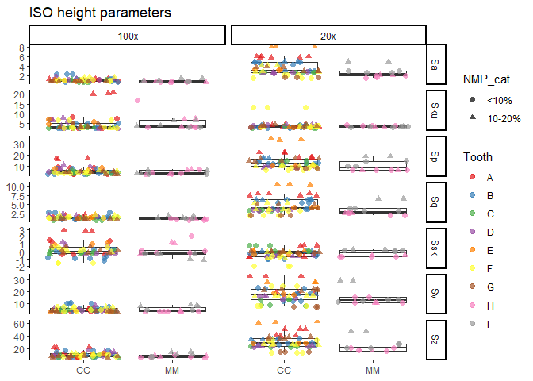
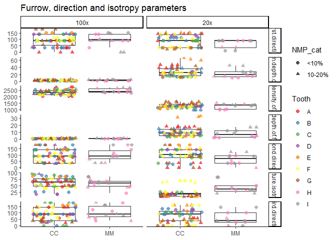
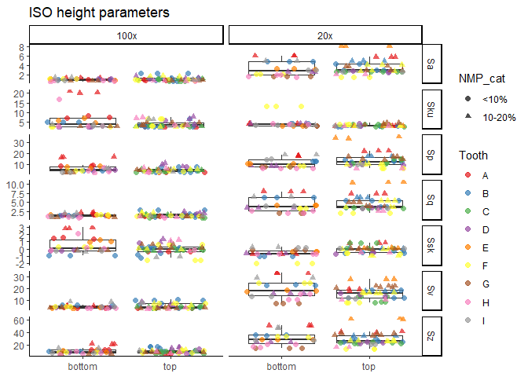
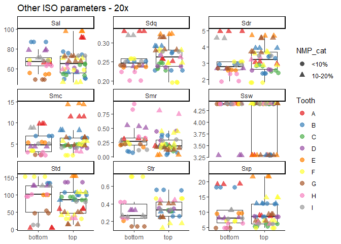
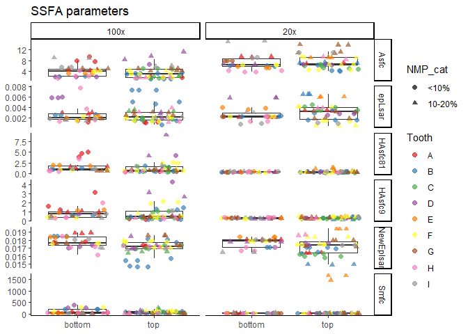

Plots for the dataset of DMTA on Devionan sharks
================
Ivan Calandra
2023-08-07 12:56:31 CEST

- [Goal of the script](#goal-of-the-script)
- [Load packages](#load-packages)
- [Read in data](#read-in-data)
  - [Get name and path of input file](#get-name-and-path-of-input-file)
  - [Read in Rbin file](#read-in-rbin-file)
- [Exclude surfaces with NMP ≥ 20%](#exclude-surfaces-with-nmp--20)
- [Plot each surface parameter in a
  boxplot](#plot-each-surface-parameter-in-a-boxplot)
  - [Define variables](#define-variables)
  - [Plotting function](#plotting-function)
  - [Plot](#plot)
    - [ISO 25178 height parameters](#iso-25178-height-parameters)
    - [ISO 25178 volume parameters](#iso-25178-volume-parameters)
    - [Other ISO 25178 parameters](#other-iso-25178-parameters)
    - [Furrow, direction and isotropy
      parameters](#furrow-direction-and-isotropy-parameters)
    - [SSFA parameters](#ssfa-parameters)
  - [Save plots](#save-plots)
- [Plot anisotropy vs. complexity](#plot-anisotropy-vs-complexity)
  - [Plot](#plot-1)
  - [Save plot](#save-plot)
- [PCA](#pca)
  - [Prepare data and select
    parameters](#prepare-data-and-select-parameters)
  - [PCA of specimens (CC vs. MM)](#pca-of-specimens-cc-vs-mm)
  - [PCA of Teeth within CC](#pca-of-teeth-within-cc)
  - [Save plots](#save-plots-1)
- [sessionInfo()](#sessioninfo)
- [Cite R packages used](#cite-r-packages-used)
  - [References](#references)

------------------------------------------------------------------------

# Goal of the script

The script plots all SSFA variables for the Devonian shark dataset.

``` r
dir_in  <- "analysis/derived_data"
dir_out <- "analysis/plots"
```

Input Rbin data file must be located in “./analysis/derived_data”.  
Plots will be saved in “./analysis/plots”.

The knit directory for this script is the project directory.

------------------------------------------------------------------------

# Load packages

``` r
pack_to_load <- c("factoextra", "ggplot2", "ggpubr", "grateful", "knitr", 
                  "R.utils", "RColorBrewer", "rmarkdown", "tidyverse")
sapply(pack_to_load, library, character.only = TRUE, logical.return = TRUE)
```

      factoextra      ggplot2       ggpubr     grateful        knitr      R.utils 
            TRUE         TRUE         TRUE         TRUE         TRUE         TRUE 
    RColorBrewer    rmarkdown    tidyverse 
            TRUE         TRUE         TRUE 

------------------------------------------------------------------------

# Read in data

## Get name and path of input file

``` r
info_in <- list.files(dir_in, pattern = "\\.Rbin$", full.names = TRUE)
info_in
```

    [1] "analysis/derived_data/DMTA-Ctenacanths.Rbin"

## Read in Rbin file

``` r
sharks <- loadObject(info_in)
str(sharks)
```

    'data.frame':   160 obs. of  42 variables:
     $ Specimen                : chr  "CC" "CC" "CC" "CC" ...
     $ Tooth                   : chr  "A" "A" "A" "A" ...
     $ Location                : chr  "loc1" "loc1" "loc1" "loc2" ...
     $ Objective               : chr  "100x" "100x" "100x" "100x" ...
     $ Measurement             : chr  "meas1" "meas2" "meas3" "meas1" ...
     $ NMP                     : num  3.03 3.05 3.34 9.84 9.78 ...
     $ NMP_cat                 : Ord.factor w/ 3 levels "<10%"<"10-20%"<..: 1 1 1 1 1 1 2 2 2 1 ...
     $ Sq                      : num  1.22 1.18 1.16 1.66 1.66 ...
     $ Ssk                     : num  -0.332 -0.345 -0.355 1.53 1.454 ...
     $ Sku                     : num  2.53 2.45 2.42 8.22 7.72 ...
     $ Sp                      : num  2.74 2.73 2.69 8.77 8.39 ...
     $ Sv                      : num  3.42 3.25 3.17 3.39 3.45 ...
     $ Sz                      : num  6.16 5.98 5.86 12.16 11.84 ...
     $ Sa                      : num  0.995 0.969 0.956 1.14 1.154 ...
     $ Smr                     : num  5.865 4.991 4.781 0.361 0.405 ...
     $ Smc                     : num  1.5 1.47 1.43 1.3 1.32 ...
     $ Sxp                     : num  2.62 2.5 2.48 2.77 2.76 ...
     $ Sal                     : num  20.7 20.4 20.3 15.3 15.2 ...
     $ Str                     : num  0.557 0.53 0.537 0.408 0.396 ...
     $ Std                     : num  58.5 58.5 58.5 84.5 84.5 ...
     $ Ssw                     : num  0.658 0.658 0.658 0.658 0.658 ...
     $ Sdq                     : num  0.179 0.176 0.176 0.409 0.395 ...
     $ Sdr                     : num  1.51 1.47 1.46 4.86 4.71 ...
     $ Vm                      : num  0.0382 0.033 0.032 0.2068 0.2047 ...
     $ Vv                      : num  1.54 1.5 1.47 1.51 1.53 ...
     $ Vmp                     : num  0.0382 0.033 0.032 0.2068 0.2047 ...
     $ Vmc                     : num  1.21 1.18 1.15 1.16 1.18 ...
     $ Vvc                     : num  1.39 1.35 1.32 1.35 1.37 ...
     $ Vvv                     : num  0.148 0.148 0.147 0.154 0.155 ...
     $ Maximum.depth.of.furrows: num  2.33 2.29 2.29 4.51 4.52 ...
     $ Mean.depth.of.furrows   : num  0.834 0.808 0.792 1.292 1.286 ...
     $ Mean.density.of.furrows : num  2027 2022 2034 2211 2229 ...
     $ First.direction         : num  37 37 37 90 90 ...
     $ Second.direction        : num  56.5 90 90 84.3 84.3 ...
     $ Third.direction         : num  90 56.6 56.6 78.7 78.7 ...
     $ Texture.isotropy        : num  47.3 51.9 58.7 72.8 68 ...
     $ epLsar                  : num  0.00119 0.00113 0.00124 0.00152 0.0018 ...
     $ NewEplsar               : num  0.0172 0.0172 0.0173 0.0176 0.0177 ...
     $ Asfc                    : num  1.85 1.79 1.82 9.4 7.54 ...
     $ Smfc                    : num  86.2 48.8 52 37.9 62.8 ...
     $ HAsfc9                  : num  0.249 0.233 0.172 3.11 1.59 ...
     $ HAsfc81                 : num  0.591 0.582 0.516 4.706 5.056 ...
     - attr(*, "comment")= Named chr [1:36] "%" "µm" "<no unit>" "<no unit>" ...
      ..- attr(*, "names")= chr [1:36] "NMP" "Sq" "Ssk" "Sku" ...

------------------------------------------------------------------------

# Exclude surfaces with NMP ≥ 20%

Surfaces with more than 20% NMP should not be analyzed.

``` r
sharks_nmp0_20 <- filter(sharks, NMP_cat != "≥20%")
sharks_nmp0_20$NMP_cat <- factor(sharks_nmp0_20$NMP_cat)
str(sharks_nmp0_20)
```

    'data.frame':   144 obs. of  42 variables:
     $ Specimen                : chr  "CC" "CC" "CC" "CC" ...
     $ Tooth                   : chr  "A" "A" "A" "A" ...
     $ Location                : chr  "loc1" "loc1" "loc1" "loc2" ...
     $ Objective               : chr  "100x" "100x" "100x" "100x" ...
     $ Measurement             : chr  "meas1" "meas2" "meas3" "meas1" ...
     $ NMP                     : num  3.03 3.05 3.34 9.84 9.78 ...
     $ NMP_cat                 : Ord.factor w/ 2 levels "<10%"<"10-20%": 1 1 1 1 1 1 2 2 2 1 ...
     $ Sq                      : num  1.22 1.18 1.16 1.66 1.66 ...
     $ Ssk                     : num  -0.332 -0.345 -0.355 1.53 1.454 ...
     $ Sku                     : num  2.53 2.45 2.42 8.22 7.72 ...
     $ Sp                      : num  2.74 2.73 2.69 8.77 8.39 ...
     $ Sv                      : num  3.42 3.25 3.17 3.39 3.45 ...
     $ Sz                      : num  6.16 5.98 5.86 12.16 11.84 ...
     $ Sa                      : num  0.995 0.969 0.956 1.14 1.154 ...
     $ Smr                     : num  5.865 4.991 4.781 0.361 0.405 ...
     $ Smc                     : num  1.5 1.47 1.43 1.3 1.32 ...
     $ Sxp                     : num  2.62 2.5 2.48 2.77 2.76 ...
     $ Sal                     : num  20.7 20.4 20.3 15.3 15.2 ...
     $ Str                     : num  0.557 0.53 0.537 0.408 0.396 ...
     $ Std                     : num  58.5 58.5 58.5 84.5 84.5 ...
     $ Ssw                     : num  0.658 0.658 0.658 0.658 0.658 ...
     $ Sdq                     : num  0.179 0.176 0.176 0.409 0.395 ...
     $ Sdr                     : num  1.51 1.47 1.46 4.86 4.71 ...
     $ Vm                      : num  0.0382 0.033 0.032 0.2068 0.2047 ...
     $ Vv                      : num  1.54 1.5 1.47 1.51 1.53 ...
     $ Vmp                     : num  0.0382 0.033 0.032 0.2068 0.2047 ...
     $ Vmc                     : num  1.21 1.18 1.15 1.16 1.18 ...
     $ Vvc                     : num  1.39 1.35 1.32 1.35 1.37 ...
     $ Vvv                     : num  0.148 0.148 0.147 0.154 0.155 ...
     $ Maximum.depth.of.furrows: num  2.33 2.29 2.29 4.51 4.52 ...
     $ Mean.depth.of.furrows   : num  0.834 0.808 0.792 1.292 1.286 ...
     $ Mean.density.of.furrows : num  2027 2022 2034 2211 2229 ...
     $ First.direction         : num  37 37 37 90 90 ...
     $ Second.direction        : num  56.5 90 90 84.3 84.3 ...
     $ Third.direction         : num  90 56.6 56.6 78.7 78.7 ...
     $ Texture.isotropy        : num  47.3 51.9 58.7 72.8 68 ...
     $ epLsar                  : num  0.00119 0.00113 0.00124 0.00152 0.0018 ...
     $ NewEplsar               : num  0.0172 0.0172 0.0173 0.0176 0.0177 ...
     $ Asfc                    : num  1.85 1.79 1.82 9.4 7.54 ...
     $ Smfc                    : num  86.2 48.8 52 37.9 62.8 ...
     $ HAsfc9                  : num  0.249 0.233 0.172 3.11 1.59 ...
     $ HAsfc81                 : num  0.591 0.582 0.516 4.706 5.056 ...
     - attr(*, "comment")= Named chr [1:36] "%" "µm" "<no unit>" "<no unit>" ...
      ..- attr(*, "names")= chr [1:36] "NMP" "Sq" "Ssk" "Sku" ...

------------------------------------------------------------------------

# Plot each surface parameter in a boxplot

## Define variables

Here we define which columns are used for the boxplots.

``` r
# Column to be used to group on the x-axis
x_var <- "Specimen"

# Columns to be used on the y-axis
y_ISO_height <- colnames(sharks)[8:14] 
y_ISO_vol <- colnames(sharks)[24:29] 
y_ISO_others <- colnames(sharks)[15:23] 
y_furrow_diriso <- colnames(sharks)[30:36]
y_SSFA <- colnames(sharks)[37:42]

# colors
grp_colors <- "Tooth"

# shapes
grp_shapes <- "NMP_cat"
```

## Plotting function

``` r
custom_boxplot <- function(dat, x_axis = x_var, y_axis = "Value", 
                           group_col = grp_colors, group_shape = grp_shapes, 
                           facet_var = "Parameter"){
  
  # Define aesthetics
  p_out <- ggplot(dat, aes(x = .data[[x_axis]], y = .data[[y_axis]])) +

           # Boxplots:
           # hide outliers (all points are shown with geom_point() below) 
           geom_boxplot(outlier.shape = NA) +
  
           # Points:
           # Add layers of shapes and colors for points 
           # Jitter points
           geom_point(mapping = aes(shape = .data[[group_shape]], color = .data[[group_col]]), 
                      position = "jitter", size = 3, alpha = 0.7) +
    
           # Wrap around parameters (i.e. 1 subplot per parameter) with free y-scales
           facet_wrap(as.formula(paste0("~", facet_var)), scales = "free_y") +
  
           # Remove x- and y-axis labels
           labs(x = NULL, y = NULL) + 
  
           # Choose a light theme
           theme_classic() +
  
           # The qualitative 'Set2' palette of RColorBrewer is colorblind friendly
           scale_color_brewer(palette = 'Set2')

  # Return ggplot object
  return(p_out)
}
```

## Plot

### ISO 25178 height parameters

``` r
# Subset and pivot to longer format for facet plots
ISO_height_long <- select(sharks_nmp0_20, all_of(c(x_var, y_ISO_height, grp_colors, grp_shapes))) %>%
                   pivot_longer(all_of(y_ISO_height), names_to = "Parameter", values_to = "Value")
str(ISO_height_long)
```

    tibble [1,008 × 5] (S3: tbl_df/tbl/data.frame)
     $ Specimen : chr [1:1008] "CC" "CC" "CC" "CC" ...
     $ Tooth    : chr [1:1008] "A" "A" "A" "A" ...
     $ NMP_cat  : Ord.factor w/ 2 levels "<10%"<"10-20%": 1 1 1 1 1 1 1 1 1 1 ...
     $ Parameter: chr [1:1008] "Sq" "Ssk" "Sku" "Sp" ...
     $ Value    : num [1:1008] 1.217 -0.332 2.531 2.739 3.419 ...

``` r
head(ISO_height_long)
```

    # A tibble: 6 × 5
      Specimen Tooth NMP_cat Parameter  Value
      <chr>    <chr> <ord>   <chr>      <dbl>
    1 CC       A     <10%    Sq         1.22 
    2 CC       A     <10%    Ssk       -0.332
    3 CC       A     <10%    Sku        2.53 
    4 CC       A     <10%    Sp         2.74 
    5 CC       A     <10%    Sv         3.42 
    6 CC       A     <10%    Sz         6.16 

``` r
# Define plot
p_ISO_height <- custom_boxplot(dat = ISO_height_long)

# Print plot
print(p_ISO_height)
```

    Warning: Using shapes for an ordinal variable is not advised

<!-- -->

### ISO 25178 volume parameters

``` r
ISO_vol_long <- select(sharks_nmp0_20, all_of(c(x_var, y_ISO_vol, grp_colors, grp_shapes))) %>%
                pivot_longer(all_of(y_ISO_vol), names_to = "Parameter", values_to = "Value")

p_ISO_vol <- custom_boxplot(dat = ISO_vol_long)
print(p_ISO_vol)
```

    Warning: Using shapes for an ordinal variable is not advised

<!-- -->

### Other ISO 25178 parameters

``` r
ISO_others_long <- select(sharks_nmp0_20, all_of(c(x_var, y_ISO_others, grp_colors, grp_shapes))) %>%
                   pivot_longer(all_of(y_ISO_others), names_to = "Parameter", values_to = "Value")

p_ISO_others <- custom_boxplot(dat = ISO_others_long)
print(p_ISO_others)
```

    Warning: Using shapes for an ordinal variable is not advised

    Warning: Removed 45 rows containing non-finite values (`stat_boxplot()`).

    Warning: Removed 45 rows containing missing values (`geom_point()`).

<!-- -->

### Furrow, direction and isotropy parameters

``` r
furrow_diriso_long <- select(sharks_nmp0_20, all_of(c(x_var, y_furrow_diriso, grp_colors, grp_shapes))) %>%
                      pivot_longer(all_of(y_furrow_diriso), names_to = "Parameter", values_to = "Value")

p_furrow_diriso <- custom_boxplot(dat = furrow_diriso_long)
print(p_furrow_diriso)
```

    Warning: Using shapes for an ordinal variable is not advised

    Warning: Removed 9 rows containing non-finite values (`stat_boxplot()`).

    Warning: Removed 9 rows containing missing values (`geom_point()`).

<!-- -->

### SSFA parameters

``` r
ssfa_long <- select(sharks_nmp0_20, all_of(c(x_var, y_SSFA, grp_colors, grp_shapes))) %>%
                    pivot_longer(all_of(y_SSFA), names_to = "Parameter", values_to = "Value")

p_ssfa_long <- custom_boxplot(dat = ssfa_long)
print(p_ssfa_long)
```

    Warning: Using shapes for an ordinal variable is not advised

    Warning: Removed 3 rows containing non-finite values (`stat_boxplot()`).

    Warning: Removed 3 rows containing missing values (`geom_point()`).

<!-- -->

## Save plots

``` r
ggexport(plotlist = list(p_ISO_height, p_ISO_vol, p_ISO_others, p_furrow_diriso, p_ssfa_long), 
         filename = paste0(dir_out, "/DMTA-Ctenacanths_boxplots.pdf"))
```

    Warning: Using shapes for an ordinal variable is not advised
    Using shapes for an ordinal variable is not advised
    Using shapes for an ordinal variable is not advised

    Warning: Removed 45 rows containing non-finite values (`stat_boxplot()`).

    Warning: Removed 45 rows containing missing values (`geom_point()`).

    Warning: Using shapes for an ordinal variable is not advised

    Warning: Removed 9 rows containing non-finite values (`stat_boxplot()`).

    Warning: Removed 9 rows containing missing values (`geom_point()`).

    Warning: Using shapes for an ordinal variable is not advised

    Warning: Removed 3 rows containing non-finite values (`stat_boxplot()`).

    Warning: Removed 3 rows containing missing values (`geom_point()`).

------------------------------------------------------------------------

# Plot anisotropy vs. complexity

## Plot

``` r
# set up plot
p_bi <- ggplot(sharks_nmp0_20, aes(x = Asfc, y = epLsar)) +
        
        # Scatterplot
        geom_point(mapping = aes(color = .data[[grp_colors]], shape = .data[[grp_shapes]]), size = 4) +
  
        # Adjust axes labels
        labs(x = "Complexity (Asfc)", y = "Anisotropy (epLsar)") +
  
        # The qualitative 'Set2' palette of RColorBrewer is colorblind friendly
        scale_color_brewer(palette = 'Set2') +
  
        # Wrap around Specimen (i.e. 1 subplot per specimen)
        facet_wrap(~ Specimen) +
  
        # Choose a light theme
        theme_classic()

# Print plot
print(p_bi)
```

    Warning: Using shapes for an ordinal variable is not advised

<!-- -->

## Save plot

``` r
ggexport(plotlist = list(p_bi), filename = paste0(dir_out, "/DMTA-Ctenacanths_epLsar-Asfc.pdf"))
```

    Warning: Using shapes for an ordinal variable is not advised

------------------------------------------------------------------------

# PCA

## Prepare data and select parameters

``` r
# Remove rows with NA 
data_pca <- na.omit(sharks_nmp0_20)

# Convert grouping variables into factor()
data_pca[["Specimen"]] <- factor(data_pca[["Specimen"]])
data_pca[["Tooth"]] <- factor(data_pca[["Tooth"]])
str(data_pca)
```

    'data.frame':   93 obs. of  42 variables:
     $ Specimen                : Factor w/ 2 levels "CC","MM": 1 1 1 1 1 1 1 1 1 1 ...
     $ Tooth                   : Factor w/ 7 levels "A","B","C","D",..: 1 1 1 1 1 1 1 1 1 2 ...
     $ Location                : chr  "loc1" "loc1" "loc1" "loc2" ...
     $ Objective               : chr  "100x" "100x" "100x" "100x" ...
     $ Measurement             : chr  "meas1" "meas2" "meas3" "meas1" ...
     $ NMP                     : num  3.03 3.05 3.34 9.84 9.78 ...
     $ NMP_cat                 : Ord.factor w/ 2 levels "<10%"<"10-20%": 1 1 1 1 1 1 2 2 2 1 ...
     $ Sq                      : num  1.22 1.18 1.16 1.66 1.66 ...
     $ Ssk                     : num  -0.332 -0.345 -0.355 1.53 1.454 ...
     $ Sku                     : num  2.53 2.45 2.42 8.22 7.72 ...
     $ Sp                      : num  2.74 2.73 2.69 8.77 8.39 ...
     $ Sv                      : num  3.42 3.25 3.17 3.39 3.45 ...
     $ Sz                      : num  6.16 5.98 5.86 12.16 11.84 ...
     $ Sa                      : num  0.995 0.969 0.956 1.14 1.154 ...
     $ Smr                     : num  5.865 4.991 4.781 0.361 0.405 ...
     $ Smc                     : num  1.5 1.47 1.43 1.3 1.32 ...
     $ Sxp                     : num  2.62 2.5 2.48 2.77 2.76 ...
     $ Sal                     : num  20.7 20.4 20.3 15.3 15.2 ...
     $ Str                     : num  0.557 0.53 0.537 0.408 0.396 ...
     $ Std                     : num  58.5 58.5 58.5 84.5 84.5 ...
     $ Ssw                     : num  0.658 0.658 0.658 0.658 0.658 ...
     $ Sdq                     : num  0.179 0.176 0.176 0.409 0.395 ...
     $ Sdr                     : num  1.51 1.47 1.46 4.86 4.71 ...
     $ Vm                      : num  0.0382 0.033 0.032 0.2068 0.2047 ...
     $ Vv                      : num  1.54 1.5 1.47 1.51 1.53 ...
     $ Vmp                     : num  0.0382 0.033 0.032 0.2068 0.2047 ...
     $ Vmc                     : num  1.21 1.18 1.15 1.16 1.18 ...
     $ Vvc                     : num  1.39 1.35 1.32 1.35 1.37 ...
     $ Vvv                     : num  0.148 0.148 0.147 0.154 0.155 ...
     $ Maximum.depth.of.furrows: num  2.33 2.29 2.29 4.51 4.52 ...
     $ Mean.depth.of.furrows   : num  0.834 0.808 0.792 1.292 1.286 ...
     $ Mean.density.of.furrows : num  2027 2022 2034 2211 2229 ...
     $ First.direction         : num  37 37 37 90 90 ...
     $ Second.direction        : num  56.5 90 90 84.3 84.3 ...
     $ Third.direction         : num  90 56.6 56.6 78.7 78.7 ...
     $ Texture.isotropy        : num  47.3 51.9 58.7 72.8 68 ...
     $ epLsar                  : num  0.00119 0.00113 0.00124 0.00152 0.0018 ...
     $ NewEplsar               : num  0.0172 0.0172 0.0173 0.0176 0.0177 ...
     $ Asfc                    : num  1.85 1.79 1.82 9.4 7.54 ...
     $ Smfc                    : num  86.2 48.8 52 37.9 62.8 ...
     $ HAsfc9                  : num  0.249 0.233 0.172 3.11 1.59 ...
     $ HAsfc81                 : num  0.591 0.582 0.516 4.706 5.056 ...
     - attr(*, "comment")= Named chr [1:36] "%" "µm" "<no unit>" "<no unit>" ...
      ..- attr(*, "names")= chr [1:36] "NMP" "Sq" "Ssk" "Sku" ...
     - attr(*, "na.action")= 'omit' Named int [1:51] 10 13 14 19 20 21 23 24 25 26 ...
      ..- attr(*, "names")= chr [1:51] "10" "13" "14" "19" ...

``` r
# Select parameters to use in the PCA, based on previous plots
pca_params <- c("Sq", "Vmc", "Sal", "Sdr", "Str", 
                "First.direction", "Mean.density.of.furrows", "Mean.depth.of.furrows", 
                "Asfc", "epLsar", "HAsfc9")
```

## PCA of specimens (CC vs. MM)

``` r
# PCA 
pca_spec <- prcomp(data_pca[ , pca_params], scale. = TRUE) 

# Visualize eigenvalues
pca_spec_eig <- fviz_eig(pca_spec, addlabels = TRUE, ggtheme = theme_classic(), 
                         title = "PCA Specimen - Eigenvalues")
print(pca_spec_eig)
```

<!-- -->

``` r
# Biplot of PC1&2
pca_spec_12 <- fviz_pca_biplot(pca_spec, axes = c(1, 2), 
                               geom.ind = "point", col.ind = data_pca$Specimen, mean.point = FALSE,
                               palette = brewer.pal(3, "Set2")[1:2], pointsize = 3, 
                               addEllipses = TRUE, ellipse.type = "convex",  
                               repel = TRUE, col.var = "black", 
                               legend.title = "Specimen", title = "PCA Specimen - PC1&2")
print(pca_spec_12)
```

<!-- -->

``` r
# Biplot of PC1&3
pca_spec_13 <- fviz_pca_biplot(pca_spec, axes = c(1, 3), 
                               geom.ind = "point", col.ind = data_pca$Specimen, mean.point = FALSE,
                               palette = brewer.pal(3, "Set2")[1:2], pointsize = 3, 
                               addEllipses = TRUE, ellipse.type = "convex",  
                               repel = TRUE, col.var = "black", 
                               legend.title = "Specimen", title = "PCA Specimen - PC1&3")
print(pca_spec_13)
```

<!-- -->

## PCA of Teeth within CC

``` r
# Filter data on Specimen CC
data_pca_tooth <- filter(data_pca, Specimen == "CC")
str(data_pca_tooth)
```

    'data.frame':   69 obs. of  42 variables:
     $ Specimen                : Factor w/ 2 levels "CC","MM": 1 1 1 1 1 1 1 1 1 1 ...
     $ Tooth                   : Factor w/ 7 levels "A","B","C","D",..: 1 1 1 1 1 1 1 1 1 2 ...
     $ Location                : chr  "loc1" "loc1" "loc1" "loc2" ...
     $ Objective               : chr  "100x" "100x" "100x" "100x" ...
     $ Measurement             : chr  "meas1" "meas2" "meas3" "meas1" ...
     $ NMP                     : num  3.03 3.05 3.34 9.84 9.78 ...
     $ NMP_cat                 : Ord.factor w/ 2 levels "<10%"<"10-20%": 1 1 1 1 1 1 2 2 2 1 ...
     $ Sq                      : num  1.22 1.18 1.16 1.66 1.66 ...
     $ Ssk                     : num  -0.332 -0.345 -0.355 1.53 1.454 ...
     $ Sku                     : num  2.53 2.45 2.42 8.22 7.72 ...
     $ Sp                      : num  2.74 2.73 2.69 8.77 8.39 ...
     $ Sv                      : num  3.42 3.25 3.17 3.39 3.45 ...
     $ Sz                      : num  6.16 5.98 5.86 12.16 11.84 ...
     $ Sa                      : num  0.995 0.969 0.956 1.14 1.154 ...
     $ Smr                     : num  5.865 4.991 4.781 0.361 0.405 ...
     $ Smc                     : num  1.5 1.47 1.43 1.3 1.32 ...
     $ Sxp                     : num  2.62 2.5 2.48 2.77 2.76 ...
     $ Sal                     : num  20.7 20.4 20.3 15.3 15.2 ...
     $ Str                     : num  0.557 0.53 0.537 0.408 0.396 ...
     $ Std                     : num  58.5 58.5 58.5 84.5 84.5 ...
     $ Ssw                     : num  0.658 0.658 0.658 0.658 0.658 ...
     $ Sdq                     : num  0.179 0.176 0.176 0.409 0.395 ...
     $ Sdr                     : num  1.51 1.47 1.46 4.86 4.71 ...
     $ Vm                      : num  0.0382 0.033 0.032 0.2068 0.2047 ...
     $ Vv                      : num  1.54 1.5 1.47 1.51 1.53 ...
     $ Vmp                     : num  0.0382 0.033 0.032 0.2068 0.2047 ...
     $ Vmc                     : num  1.21 1.18 1.15 1.16 1.18 ...
     $ Vvc                     : num  1.39 1.35 1.32 1.35 1.37 ...
     $ Vvv                     : num  0.148 0.148 0.147 0.154 0.155 ...
     $ Maximum.depth.of.furrows: num  2.33 2.29 2.29 4.51 4.52 ...
     $ Mean.depth.of.furrows   : num  0.834 0.808 0.792 1.292 1.286 ...
     $ Mean.density.of.furrows : num  2027 2022 2034 2211 2229 ...
     $ First.direction         : num  37 37 37 90 90 ...
     $ Second.direction        : num  56.5 90 90 84.3 84.3 ...
     $ Third.direction         : num  90 56.6 56.6 78.7 78.7 ...
     $ Texture.isotropy        : num  47.3 51.9 58.7 72.8 68 ...
     $ epLsar                  : num  0.00119 0.00113 0.00124 0.00152 0.0018 ...
     $ NewEplsar               : num  0.0172 0.0172 0.0173 0.0176 0.0177 ...
     $ Asfc                    : num  1.85 1.79 1.82 9.4 7.54 ...
     $ Smfc                    : num  86.2 48.8 52 37.9 62.8 ...
     $ HAsfc9                  : num  0.249 0.233 0.172 3.11 1.59 ...
     $ HAsfc81                 : num  0.591 0.582 0.516 4.706 5.056 ...
     - attr(*, "comment")= Named chr [1:36] "%" "µm" "<no unit>" "<no unit>" ...
      ..- attr(*, "names")= chr [1:36] "NMP" "Sq" "Ssk" "Sku" ...
     - attr(*, "na.action")= 'omit' Named int [1:51] 10 13 14 19 20 21 23 24 25 26 ...
      ..- attr(*, "names")= chr [1:51] "10" "13" "14" "19" ...

``` r
# PCA 
pca_tooth <- prcomp(data_pca_tooth[ , pca_params], scale. = TRUE) 

# Visualize eigenvalues
pca_tooth_eig <- fviz_eig(pca_tooth, addlabels = TRUE, ggtheme = theme_classic(), 
                          title = "PCA Tooth - Eigenvalues")
print(pca_tooth_eig)
```

<!-- -->

``` r
# Biplot of PC1&2
pca_tooth_12 <- fviz_pca_biplot(pca_tooth, axes = c(1, 2), 
                                geom.ind = "point", col.ind = data_pca_tooth$Tooth, 
                                fill.ind = data_pca_tooth$Tooth, mean.point = FALSE, 
                                palette = brewer.pal(7, "Set2"), pointsize = 3, pointshape = 21,
                                addEllipses = TRUE, ellipse.type = "convex",  
                                repel = TRUE, col.var = "black", 
                                legend.title = "Specimen", title = "PCA Tooth - PC1&2")
print(pca_tooth_12)
```

<!-- -->

``` r
# Biplot of PC1&3
pca_tooth_13 <- fviz_pca_biplot(pca_tooth, axes = c(1, 3), 
                                geom.ind = "point", col.ind = data_pca_tooth$Tooth, 
                                fill.ind = data_pca_tooth$Tooth, mean.point = FALSE, 
                                palette = brewer.pal(7, "Set2"), pointsize = 3, pointshape = 21,
                                addEllipses = TRUE, ellipse.type = "convex",  
                                repel = TRUE, col.var = "black", 
                                legend.title = "Specimen", title = "PCA Tooth - PC1&3")
print(pca_tooth_13)
```

<!-- -->

## Save plots

``` r
ggexport(plotlist = list(pca_spec_eig, pca_spec_12, pca_spec_13, 
                         pca_tooth_eig, pca_tooth_12, pca_tooth_13), 
         filename = paste0(dir_out, "/DMTA-Ctenacanths_PCA.pdf"))
```

------------------------------------------------------------------------

# sessionInfo()

``` r
sessionInfo()
```

    R version 4.3.1 (2023-06-16 ucrt)
    Platform: x86_64-w64-mingw32/x64 (64-bit)
    Running under: Windows 10 x64 (build 19043)

    Matrix products: default


    locale:
    [1] LC_COLLATE=English_United States.utf8 
    [2] LC_CTYPE=English_United States.utf8   
    [3] LC_MONETARY=English_United States.utf8
    [4] LC_NUMERIC=C                          
    [5] LC_TIME=English_United States.utf8    

    time zone: Europe/Berlin
    tzcode source: internal

    attached base packages:
    [1] stats     graphics  grDevices utils     datasets  methods   base     

    other attached packages:
     [1] lubridate_1.9.2    forcats_1.0.0      stringr_1.5.0      dplyr_1.1.2       
     [5] purrr_1.0.1        readr_2.1.4        tidyr_1.3.0        tibble_3.2.1      
     [9] tidyverse_2.0.0    rmarkdown_2.23     RColorBrewer_1.1-3 R.utils_2.12.2    
    [13] R.oo_1.25.0        R.methodsS3_1.8.2  knitr_1.43         grateful_0.2.0    
    [17] ggpubr_0.6.0       factoextra_1.0.7   ggplot2_3.4.2     

    loaded via a namespace (and not attached):
     [1] sass_0.4.7        utf8_1.2.3        generics_0.1.3    rstatix_0.7.2    
     [5] stringi_1.7.12    hms_1.1.3         digest_0.6.33     magrittr_2.0.3   
     [9] timechange_0.2.0  evaluate_0.21     grid_4.3.1        fastmap_1.1.1    
    [13] rprojroot_2.0.3   jsonlite_1.8.7    ggrepel_0.9.3     backports_1.4.1  
    [17] fansi_1.0.4       scales_1.2.1      jquerylib_0.1.4   abind_1.4-5      
    [21] cli_3.6.1         rlang_1.1.1       crayon_1.5.2      munsell_0.5.0    
    [25] withr_2.5.0       cachem_1.0.8      yaml_2.3.7        tools_4.3.1      
    [29] tzdb_0.4.0        ggsignif_0.6.4    colorspace_2.1-0  broom_1.0.5      
    [33] vctrs_0.6.3       R6_2.5.1          lifecycle_1.0.3   car_3.1-2        
    [37] pkgconfig_2.0.3   pillar_1.9.0      bslib_0.5.0       gtable_0.3.3     
    [41] glue_1.6.2        Rcpp_1.0.11       highr_0.10        xfun_0.39        
    [45] tidyselect_1.2.0  rstudioapi_0.15.0 farver_2.1.1      htmltools_0.5.5  
    [49] labeling_0.4.2    carData_3.0-5     compiler_4.3.1   

------------------------------------------------------------------------

# Cite R packages used

We used R version 4.3.1 (R Core Team 2023) and the following R packages:
factoextra v. 1.0.7 (Kassambara and Mundt 2020), ggpubr v. 0.6.0
(Kassambara 2023), grateful v. 0.2.0 (Francisco Rodríguez-Sánchez,
Connor P. Jackson, and Shaurita D. Hutchins 2023), knitr v. 1.43 (Xie
2014, 2015, 2023), R.utils v. 2.12.2 (Bengtsson 2022), RColorBrewer v.
1.1.3 (Neuwirth 2022), rmarkdown v. 2.23 (Xie, Allaire, and Grolemund
2018; Xie, Dervieux, and Riederer 2020; Allaire et al. 2023), tidyverse
v. 2.0.0 (Wickham et al. 2019), running in RStudio v. 2023.6.1.524
(Posit team 2023).

## References

<div id="refs" class="references csl-bib-body hanging-indent">

<div id="ref-rmarkdown2023" class="csl-entry">

Allaire, JJ, Yihui Xie, Christophe Dervieux, Jonathan McPherson, Javier
Luraschi, Kevin Ushey, Aron Atkins, et al. 2023.
*<span class="nocase">rmarkdown</span>: Dynamic Documents for r*.
<https://github.com/rstudio/rmarkdown>.

</div>

<div id="ref-Rutils" class="csl-entry">

Bengtsson, Henrik. 2022. *<span class="nocase">R.utils</span>: Various
Programming Utilities*. <https://CRAN.R-project.org/package=R.utils>.

</div>

<div id="ref-grateful" class="csl-entry">

Francisco Rodríguez-Sánchez, Connor P. Jackson, and Shaurita D.
Hutchins. 2023. *<span class="nocase">grateful</span>: Facilitate
Citation of r Packages*. <https://github.com/Pakillo/grateful>.

</div>

<div id="ref-ggpubr" class="csl-entry">

Kassambara, Alboukadel. 2023. *<span class="nocase">ggpubr</span>:
“<span class="nocase">ggplot2</span>” Based Publication Ready Plots*.
<https://CRAN.R-project.org/package=ggpubr>.

</div>

<div id="ref-factoextra" class="csl-entry">

Kassambara, Alboukadel, and Fabian Mundt. 2020.
*<span class="nocase">factoextra</span>: Extract and Visualize the
Results of Multivariate Data Analyses*.
<https://CRAN.R-project.org/package=factoextra>.

</div>

<div id="ref-RColorBrewer" class="csl-entry">

Neuwirth, Erich. 2022. *RColorBrewer: ColorBrewer Palettes*.
<https://CRAN.R-project.org/package=RColorBrewer>.

</div>

<div id="ref-rstudio" class="csl-entry">

Posit team. 2023. *RStudio: Integrated Development Environment for r*.
Boston, MA: Posit Software, PBC. <http://www.posit.co/>.

</div>

<div id="ref-base" class="csl-entry">

R Core Team. 2023. *R: A Language and Environment for Statistical
Computing*. Vienna, Austria: R Foundation for Statistical Computing.
<https://www.R-project.org/>.

</div>

<div id="ref-tidyverse" class="csl-entry">

Wickham, Hadley, Mara Averick, Jennifer Bryan, Winston Chang, Lucy
D’Agostino McGowan, Romain François, Garrett Grolemund, et al. 2019.
“Welcome to the <span class="nocase">tidyverse</span>.” *Journal of Open
Source Software* 4 (43): 1686. <https://doi.org/10.21105/joss.01686>.

</div>

<div id="ref-knitr2014" class="csl-entry">

Xie, Yihui. 2014. “<span class="nocase">knitr</span>: A Comprehensive
Tool for Reproducible Research in R.” In *Implementing Reproducible
Computational Research*, edited by Victoria Stodden, Friedrich Leisch,
and Roger D. Peng. Chapman; Hall/CRC.

</div>

<div id="ref-knitr2015" class="csl-entry">

———. 2015. *Dynamic Documents with R and Knitr*. 2nd ed. Boca Raton,
Florida: Chapman; Hall/CRC. <https://yihui.org/knitr/>.

</div>

<div id="ref-knitr2023" class="csl-entry">

———. 2023. *<span class="nocase">knitr</span>: A General-Purpose Package
for Dynamic Report Generation in r*. <https://yihui.org/knitr/>.

</div>

<div id="ref-rmarkdown2018" class="csl-entry">

Xie, Yihui, J. J. Allaire, and Garrett Grolemund. 2018. *R Markdown: The
Definitive Guide*. Boca Raton, Florida: Chapman; Hall/CRC.
<https://bookdown.org/yihui/rmarkdown>.

</div>

<div id="ref-rmarkdown2020" class="csl-entry">

Xie, Yihui, Christophe Dervieux, and Emily Riederer. 2020. *R Markdown
Cookbook*. Boca Raton, Florida: Chapman; Hall/CRC.
<https://bookdown.org/yihui/rmarkdown-cookbook>.

</div>

</div>
