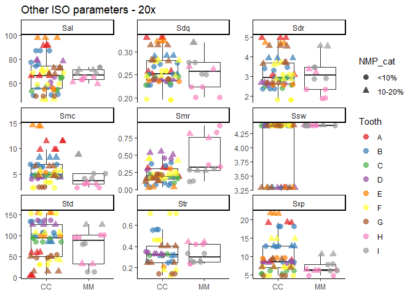
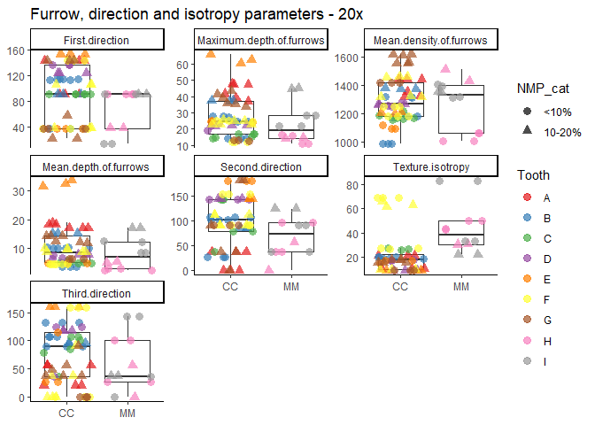
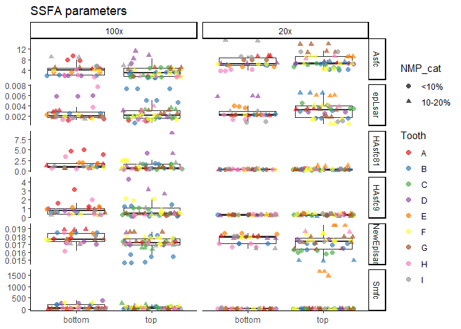
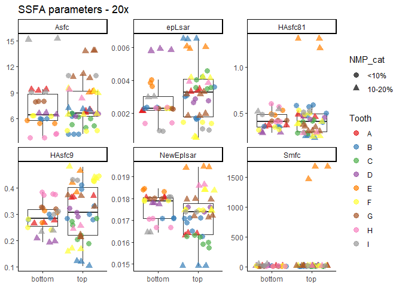
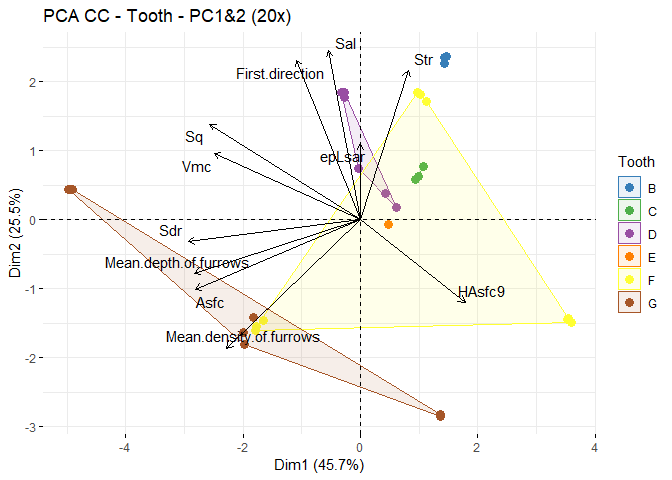

Plots for the dataset of DMTA on Devionan sharks
================
Ivan Calandra
2023-12-12 15:36:52 CET

- [Goal of the script](#goal-of-the-script)
- [Load packages](#load-packages)
- [Read in data](#read-in-data)
  - [Get name and path of input file](#get-name-and-path-of-input-file)
  - [Read in Rbin file](#read-in-rbin-file)
- [Exclude surfaces with NMP ≥ 20%](#exclude-surfaces-with-nmp--20)
- [Separate data acquired with different
  objectives](#separate-data-acquired-with-different-objectives)
- [Plot each surface parameter in a
  boxplot](#plot-each-surface-parameter-in-a-boxplot)
  - [Define variables](#define-variables)
  - [Plotting function](#plotting-function)
  - [Plot with Specimen as grouping
    variable](#plot-with-specimen-as-grouping-variable)
    - [ISO 25178 height parameters](#iso-25178-height-parameters)
    - [ISO 25178 volume parameters](#iso-25178-volume-parameters)
    - [Other ISO 25178 parameters](#other-iso-25178-parameters)
    - [Furrow, direction and isotropy
      parameters](#furrow-direction-and-isotropy-parameters)
    - [SSFA parameters](#ssfa-parameters)
    - [Save plots](#save-plots)
  - [Plot with Position as grouping
    variable](#plot-with-position-as-grouping-variable)
    - [ISO 25178 height parameters](#iso-25178-height-parameters-1)
    - [ISO 25178 volume parameters](#iso-25178-volume-parameters-1)
    - [Other ISO 25178 parameters](#other-iso-25178-parameters-1)
    - [Furrow, direction and isotropy
      parameters](#furrow-direction-and-isotropy-parameters-1)
    - [SSFA parameters](#ssfa-parameters-1)
    - [Save plots](#save-plots-1)
- [Plot anisotropy vs. complexity](#plot-anisotropy-vs-complexity)
  - [Facetting around Specimen](#facetting-around-specimen)
  - [Facetting around Position](#facetting-around-position)
  - [Save plots](#save-plots-2)
- [PCA](#pca)
  - [Prepare data and select
    parameters](#prepare-data-and-select-parameters)
  - [Run PCAs](#run-pcas)
    - [PCA on all surfaces](#pca-on-all-surfaces)
    - [PCA on Specimen CC](#pca-on-specimen-cc)
  - [Plots](#plots)
    - [Eigenvalues](#eigenvalues)
      - [On all surfaces](#on-all-surfaces)
      - [On Specimen CC](#on-specimen-cc)
    - [Biplots](#biplots)
      - [Plotting function](#plotting-function-1)
      - [On all surfaces with grouping from Specimen (CC
        vs. MM)](#on-all-surfaces-with-grouping-from-specimen-cc-vs-mm)
      - [On all surfaces with grouping from Position (bottom
        vs. top)](#on-all-surfaces-with-grouping-from-position-bottom-vs-top)
      - [On Specimen CC with grouping from
        Tooth](#on-specimen-cc-with-grouping-from-tooth)
    - [Save plots](#save-plots-3)
- [sessionInfo()](#sessioninfo)
- [Cite R packages used](#cite-r-packages-used)
  - [References](#references)

------------------------------------------------------------------------

# Goal of the script

The script plots all SSFA variables for the Devonian shark dataset.

``` r
dir_in  <- "analysis/derived_data"
dir_out <- "analysis/plots"
```

Input Rbin data file must be located in “./analysis/derived_data”.  
Plots will be saved in “./analysis/plots”.

The knit directory for this script is the project directory.

------------------------------------------------------------------------

# Load packages

``` r
pack_to_load <- sort(c("R.utils", "tidyverse", "factoextra", "ggplot2", "ggpubr", "RColorBrewer", 
                       "knitr", "rmarkdown", "grateful"))
sapply(pack_to_load, library, character.only = TRUE, logical.return = TRUE)
```

      factoextra      ggplot2       ggpubr     grateful        knitr      R.utils 
            TRUE         TRUE         TRUE         TRUE         TRUE         TRUE 
    RColorBrewer    rmarkdown    tidyverse 
            TRUE         TRUE         TRUE 

------------------------------------------------------------------------

# Read in data

## Get name and path of input file

``` r
info_in <- list.files(dir_in, pattern = "\\.Rbin$", full.names = TRUE)
info_in
```

    [1] "analysis/derived_data/DMTA-Ctenacanths.Rbin"

## Read in Rbin file

``` r
sharks <- loadObject(info_in)
str(sharks)
```

    'data.frame':   160 obs. of  43 variables:
     $ Specimen                : chr  "CC" "CC" "CC" "CC" ...
     $ Tooth                   : chr  "A" "A" "A" "A" ...
     $ Location                : chr  "loc1" "loc1" "loc1" "loc1" ...
     $ Objective               : chr  "100x" "100x" "100x" "20x" ...
     $ Measurement             : chr  "meas1" "meas2" "meas3" "meas1" ...
     $ Position                : chr  "top" "top" "top" "top" ...
     $ NMP                     : num  3.03 3.05 3.34 12.54 11.63 ...
     $ NMP_cat                 : Ord.factor w/ 3 levels "<10%"<"10-20%"<..: 1 1 1 2 2 2 1 1 1 3 ...
     $ Sq                      : num  1.22 1.18 1.16 7.28 7.29 ...
     $ Ssk                     : num  -0.332 -0.345 -0.355 0.83 0.814 ...
     $ Sku                     : num  2.53 2.45 2.42 3.15 3.14 ...
     $ Sp                      : num  2.74 2.73 2.69 22.04 22.01 ...
     $ Sv                      : num  3.42 3.25 3.17 17.88 19.03 ...
     $ Sz                      : num  6.16 5.98 5.86 39.92 41.04 ...
     $ Sa                      : num  0.995 0.969 0.956 5.8 5.803 ...
     $ Smr                     : num  5.865 4.991 4.781 0.189 0.183 ...
     $ Smc                     : num  1.5 1.47 1.43 11.42 11.45 ...
     $ Sxp                     : num  2.62 2.5 2.48 8.72 8.84 ...
     $ Sal                     : num  20.7 20.4 20.3 91.8 91.5 ...
     $ Str                     : num  0.557 0.53 0.537 NA NA ...
     $ Std                     : num  58.5 58.5 58.5 58.5 58.7 ...
     $ Ssw                     : num  0.658 0.658 0.658 3.295 3.295 ...
     $ Sdq                     : num  0.179 0.176 0.176 0.252 0.257 ...
     $ Sdr                     : num  1.51 1.47 1.46 2.97 3.08 ...
     $ Vm                      : num  0.0382 0.033 0.032 0.4189 0.414 ...
     $ Vv                      : num  1.54 1.5 1.47 11.84 11.86 ...
     $ Vmp                     : num  0.0382 0.033 0.032 0.4189 0.414 ...
     $ Vmc                     : num  1.21 1.18 1.15 5.85 5.88 ...
     $ Vvc                     : num  1.39 1.35 1.32 11.35 11.37 ...
     $ Vvv                     : num  0.148 0.148 0.147 0.487 0.496 ...
     $ Maximum.depth.of.furrows: num  2.33 2.29 2.29 41.48 39.05 ...
     $ Mean.depth.of.furrows   : num  0.834 0.808 0.792 18.822 18.342 ...
     $ Mean.density.of.furrows : num  2027 2022 2034 1354 1319 ...
     $ First.direction         : num  37 37 37 90 90 ...
     $ Second.direction        : num  56.5 90 90 37 37 ...
     $ Third.direction         : num  90 56.6 56.6 56.5 56.5 ...
     $ Texture.isotropy        : num  47.3 51.9 58.7 21 21 ...
     $ epLsar                  : num  0.00119 0.00113 0.00124 0.00347 0.00337 ...
     $ NewEplsar               : num  0.0172 0.0172 0.0173 0.0163 0.0164 ...
     $ Asfc                    : num  1.85 1.79 1.82 6.64 6.88 ...
     $ Smfc                    : num  86.2 48.8 52 12.9 12.9 ...
     $ HAsfc9                  : num  0.249 0.233 0.172 0.364 0.363 ...
     $ HAsfc81                 : num  0.591 0.582 0.516 0.486 0.459 ...
     - attr(*, "comment")= Named chr [1:36] "%" "µm" "<no unit>" "<no unit>" ...
      ..- attr(*, "names")= chr [1:36] "NMP" "Sq" "Ssk" "Sku" ...

------------------------------------------------------------------------

# Exclude surfaces with NMP ≥ 20%

Surfaces with more than 20% NMP should not be analyzed.

``` r
sharks_nmp20 <- filter(sharks, NMP_cat != "≥20%")
sharks_nmp20$NMP_cat <- factor(sharks_nmp20$NMP_cat)
str(sharks_nmp20)
```

    'data.frame':   144 obs. of  43 variables:
     $ Specimen                : chr  "CC" "CC" "CC" "CC" ...
     $ Tooth                   : chr  "A" "A" "A" "A" ...
     $ Location                : chr  "loc1" "loc1" "loc1" "loc1" ...
     $ Objective               : chr  "100x" "100x" "100x" "20x" ...
     $ Measurement             : chr  "meas1" "meas2" "meas3" "meas1" ...
     $ Position                : chr  "top" "top" "top" "top" ...
     $ NMP                     : num  3.03 3.05 3.34 12.54 11.63 ...
     $ NMP_cat                 : Ord.factor w/ 2 levels "<10%"<"10-20%": 1 1 1 2 2 2 1 1 1 2 ...
     $ Sq                      : num  1.22 1.18 1.16 7.28 7.29 ...
     $ Ssk                     : num  -0.332 -0.345 -0.355 0.83 0.814 ...
     $ Sku                     : num  2.53 2.45 2.42 3.15 3.14 ...
     $ Sp                      : num  2.74 2.73 2.69 22.04 22.01 ...
     $ Sv                      : num  3.42 3.25 3.17 17.88 19.03 ...
     $ Sz                      : num  6.16 5.98 5.86 39.92 41.04 ...
     $ Sa                      : num  0.995 0.969 0.956 5.8 5.803 ...
     $ Smr                     : num  5.865 4.991 4.781 0.189 0.183 ...
     $ Smc                     : num  1.5 1.47 1.43 11.42 11.45 ...
     $ Sxp                     : num  2.62 2.5 2.48 8.72 8.84 ...
     $ Sal                     : num  20.7 20.4 20.3 91.8 91.5 ...
     $ Str                     : num  0.557 0.53 0.537 NA NA ...
     $ Std                     : num  58.5 58.5 58.5 58.5 58.7 ...
     $ Ssw                     : num  0.658 0.658 0.658 3.295 3.295 ...
     $ Sdq                     : num  0.179 0.176 0.176 0.252 0.257 ...
     $ Sdr                     : num  1.51 1.47 1.46 2.97 3.08 ...
     $ Vm                      : num  0.0382 0.033 0.032 0.4189 0.414 ...
     $ Vv                      : num  1.54 1.5 1.47 11.84 11.86 ...
     $ Vmp                     : num  0.0382 0.033 0.032 0.4189 0.414 ...
     $ Vmc                     : num  1.21 1.18 1.15 5.85 5.88 ...
     $ Vvc                     : num  1.39 1.35 1.32 11.35 11.37 ...
     $ Vvv                     : num  0.148 0.148 0.147 0.487 0.496 ...
     $ Maximum.depth.of.furrows: num  2.33 2.29 2.29 41.48 39.05 ...
     $ Mean.depth.of.furrows   : num  0.834 0.808 0.792 18.822 18.342 ...
     $ Mean.density.of.furrows : num  2027 2022 2034 1354 1319 ...
     $ First.direction         : num  37 37 37 90 90 ...
     $ Second.direction        : num  56.5 90 90 37 37 ...
     $ Third.direction         : num  90 56.6 56.6 56.5 56.5 ...
     $ Texture.isotropy        : num  47.3 51.9 58.7 21 21 ...
     $ epLsar                  : num  0.00119 0.00113 0.00124 0.00347 0.00337 ...
     $ NewEplsar               : num  0.0172 0.0172 0.0173 0.0163 0.0164 ...
     $ Asfc                    : num  1.85 1.79 1.82 6.64 6.88 ...
     $ Smfc                    : num  86.2 48.8 52 12.9 12.9 ...
     $ HAsfc9                  : num  0.249 0.233 0.172 0.364 0.363 ...
     $ HAsfc81                 : num  0.591 0.582 0.516 0.486 0.459 ...
     - attr(*, "comment")= Named chr [1:36] "%" "µm" "<no unit>" "<no unit>" ...
      ..- attr(*, "names")= chr [1:36] "NMP" "Sq" "Ssk" "Sku" ...

# Separate data acquired with different objectives

``` r
#20x objective
sharks_nmp20_20x <- filter(sharks_nmp20, Objective == "20x")
sharks_nmp20_20x$Objective <- factor(sharks_nmp20_20x$Objective)
str(sharks_nmp20_20x)
```

    'data.frame':   69 obs. of  43 variables:
     $ Specimen                : chr  "CC" "CC" "CC" "CC" ...
     $ Tooth                   : chr  "A" "A" "A" "A" ...
     $ Location                : chr  "loc1" "loc1" "loc1" "loc3" ...
     $ Objective               : Factor w/ 1 level "20x": 1 1 1 1 1 1 1 1 1 1 ...
     $ Measurement             : chr  "meas1" "meas2" "meas3" "meas1" ...
     $ Position                : chr  "top" "top" "top" "bottom" ...
     $ NMP                     : num  12.5 11.6 11.5 13.6 13.5 ...
     $ NMP_cat                 : Ord.factor w/ 2 levels "<10%"<"10-20%": 2 2 2 2 2 2 1 1 1 1 ...
     $ Sq                      : num  7.28 7.29 7.3 7.91 7.89 ...
     $ Ssk                     : num  0.83 0.814 0.794 -0.714 -0.717 ...
     $ Sku                     : num  3.15 3.14 3.13 4.11 4.13 ...
     $ Sp                      : num  22 22 21.9 17.5 17.4 ...
     $ Sv                      : num  17.9 19 19.6 33.3 33.4 ...
     $ Sz                      : num  39.9 41 41.5 50.7 50.9 ...
     $ Sa                      : num  5.8 5.8 5.81 6.09 6.07 ...
     $ Smr                     : num  0.189 0.183 0.179 0.319 0.303 ...
     $ Smc                     : num  11.42 11.45 11.42 9.81 9.78 ...
     $ Sxp                     : num  8.72 8.84 8.94 19.26 19.17 ...
     $ Sal                     : num  91.8 91.5 91.3 66.3 66.1 ...
     $ Str                     : num  NA NA NA NA NA ...
     $ Std                     : num  58.51 58.75 58.51 3.74 3.75 ...
     $ Ssw                     : num  3.29 3.29 3.29 4.39 4.39 ...
     $ Sdq                     : num  0.252 0.257 0.257 0.33 0.33 ...
     $ Sdr                     : num  2.97 3.08 3.09 4.98 4.97 ...
     $ Vm                      : num  0.419 0.414 0.413 0.231 0.231 ...
     $ Vv                      : num  11.8 11.9 11.8 10 10 ...
     $ Vmp                     : num  0.419 0.414 0.413 0.231 0.231 ...
     $ Vmc                     : num  5.85 5.88 5.89 6.49 6.46 ...
     $ Vvc                     : num  11.35 11.37 11.33 8.82 8.8 ...
     $ Vvv                     : num  0.487 0.496 0.507 1.218 1.216 ...
     $ Maximum.depth.of.furrows: num  41.5 39.1 36.9 47.2 47 ...
     $ Mean.depth.of.furrows   : num  18.8 18.3 18.3 16.9 16.9 ...
     $ Mean.density.of.furrows : num  1354 1319 1322 1443 1442 ...
     $ First.direction         : num  90 90 90 143 143 ...
     $ Second.direction        : num  37.00583 37.00101 37.00585 0.00521 0.0164 ...
     $ Third.direction         : num  56.5 56.5 56.5 20.8 20.8 ...
     $ Texture.isotropy        : num  20.96 20.96 20.92 9.82 9.8 ...
     $ epLsar                  : num  0.00347 0.00337 0.0033 0.00213 0.00211 ...
     $ NewEplsar               : num  0.0163 0.0164 0.0164 0.0181 0.018 ...
     $ Asfc                    : num  6.64 6.88 7.01 9.35 9.23 ...
     $ Smfc                    : num  12.9 12.9 12.9 12 12 ...
     $ HAsfc9                  : num  0.364 0.363 0.37 0.265 0.276 ...
     $ HAsfc81                 : num  0.486 0.459 0.462 0.368 0.364 ...
     - attr(*, "comment")= Named chr [1:36] "%" "µm" "<no unit>" "<no unit>" ...
      ..- attr(*, "names")= chr [1:36] "NMP" "Sq" "Ssk" "Sku" ...

``` r
#100x objective
sharks_nmp20_100x <- filter(sharks_nmp20, Objective == "100x")
sharks_nmp20_100x$Objective <- factor(sharks_nmp20_100x$Objective)
str(sharks_nmp20_100x)
```

    'data.frame':   75 obs. of  43 variables:
     $ Specimen                : chr  "CC" "CC" "CC" "CC" ...
     $ Tooth                   : chr  "A" "A" "A" "A" ...
     $ Location                : chr  "loc1" "loc1" "loc1" "loc2" ...
     $ Objective               : Factor w/ 1 level "100x": 1 1 1 1 1 1 1 1 1 1 ...
     $ Measurement             : chr  "meas1" "meas2" "meas3" "meas1" ...
     $ Position                : chr  "top" "top" "top" "bottom" ...
     $ NMP                     : num  3.03 3.05 3.34 9.84 9.78 ...
     $ NMP_cat                 : Ord.factor w/ 2 levels "<10%"<"10-20%": 1 1 1 1 1 1 2 2 2 1 ...
     $ Sq                      : num  1.22 1.18 1.16 1.66 1.66 ...
     $ Ssk                     : num  -0.332 -0.345 -0.355 1.53 1.454 ...
     $ Sku                     : num  2.53 2.45 2.42 8.22 7.72 ...
     $ Sp                      : num  2.74 2.73 2.69 8.77 8.39 ...
     $ Sv                      : num  3.42 3.25 3.17 3.39 3.45 ...
     $ Sz                      : num  6.16 5.98 5.86 12.16 11.84 ...
     $ Sa                      : num  0.995 0.969 0.956 1.14 1.154 ...
     $ Smr                     : num  5.865 4.991 4.781 0.361 0.405 ...
     $ Smc                     : num  1.5 1.47 1.43 1.3 1.32 ...
     $ Sxp                     : num  2.62 2.5 2.48 2.77 2.76 ...
     $ Sal                     : num  20.7 20.4 20.3 15.3 15.2 ...
     $ Str                     : num  0.557 0.53 0.537 0.408 0.396 ...
     $ Std                     : num  58.5 58.5 58.5 84.5 84.5 ...
     $ Ssw                     : num  0.658 0.658 0.658 0.658 0.658 ...
     $ Sdq                     : num  0.179 0.176 0.176 0.409 0.395 ...
     $ Sdr                     : num  1.51 1.47 1.46 4.86 4.71 ...
     $ Vm                      : num  0.0382 0.033 0.032 0.2068 0.2047 ...
     $ Vv                      : num  1.54 1.5 1.47 1.51 1.53 ...
     $ Vmp                     : num  0.0382 0.033 0.032 0.2068 0.2047 ...
     $ Vmc                     : num  1.21 1.18 1.15 1.16 1.18 ...
     $ Vvc                     : num  1.39 1.35 1.32 1.35 1.37 ...
     $ Vvv                     : num  0.148 0.148 0.147 0.154 0.155 ...
     $ Maximum.depth.of.furrows: num  2.33 2.29 2.29 4.51 4.52 ...
     $ Mean.depth.of.furrows   : num  0.834 0.808 0.792 1.292 1.286 ...
     $ Mean.density.of.furrows : num  2027 2022 2034 2211 2229 ...
     $ First.direction         : num  37 37 37 90 90 ...
     $ Second.direction        : num  56.5 90 90 84.3 84.3 ...
     $ Third.direction         : num  90 56.6 56.6 78.7 78.7 ...
     $ Texture.isotropy        : num  47.3 51.9 58.7 72.8 68 ...
     $ epLsar                  : num  0.00119 0.00113 0.00124 0.00152 0.0018 ...
     $ NewEplsar               : num  0.0172 0.0172 0.0173 0.0176 0.0177 ...
     $ Asfc                    : num  1.85 1.79 1.82 9.4 7.54 ...
     $ Smfc                    : num  86.2 48.8 52 37.9 62.8 ...
     $ HAsfc9                  : num  0.249 0.233 0.172 3.11 1.59 ...
     $ HAsfc81                 : num  0.591 0.582 0.516 4.706 5.056 ...
     - attr(*, "comment")= Named chr [1:36] "%" "µm" "<no unit>" "<no unit>" ...
      ..- attr(*, "names")= chr [1:36] "NMP" "Sq" "Ssk" "Sku" ...

------------------------------------------------------------------------

# Plot each surface parameter in a boxplot

## Define variables

Here we define which columns are used for the boxplots.

``` r
# Columns to be used to group on the x-axis
x_sp <- "Specimen"
x_pos <- "Position"

# Columns to be used on the y-axis
y_ISO_height <- colnames(sharks)[9:15] 
y_ISO_vol <- colnames(sharks)[25:30] 
y_ISO_others <- colnames(sharks)[16:24] 
y_furrow_diriso <- colnames(sharks)[31:37]
y_SSFA <- colnames(sharks)[38:43]

# colors
grp_colors <- "Tooth"

# shapes
grp_shapes <- "NMP_cat"
```

## Plotting function

``` r
custom_boxplot <- function(dat, x_axis, y_axis = "Value", 
                           group_col = grp_colors, group_shape = grp_shapes, 
                           facet_var = "Parameter", plot_title){
  
  # Define aesthetics
  p_out <- ggplot(dat, aes(x = .data[[x_axis]], y = .data[[y_axis]])) +

           # Boxplots:
           # hide outliers (all points are shown with geom_point() below) 
           geom_boxplot(outlier.shape = NA) +
  
           # Points:
           # Add layers of shapes and colors for points 
           # Jitter points
           geom_point(mapping = aes(shape = .data[[group_shape]], color = .data[[group_col]]), 
                      position = "jitter", size = 3, alpha = 0.7) +
    
           # Wrap around parameters (i.e. 1 subplot per parameter) with free y-scales
           facet_wrap(as.formula(paste0("~", facet_var)), scales = "free_y") +
    
           # Alternative with facet.grid() (i.e. parameters in rows and objectives in columns) with free y-scales
           #facet_grid(as.formula(paste0(facet_var, "~ Objective")), scales = "free_y") +
  
           # Remove x- and y-axis labels
           labs(x = NULL, y = NULL, title = plot_title) + 
  
           # Choose a light theme
           theme_classic() +
  
           # The qualitative 'Set2' palette of RColorBrewer is colorblind friendly
           scale_color_brewer(palette = 'Set1')

  # Return ggplot object
  return(p_out)
}
```

## Plot with Specimen as grouping variable

### ISO 25178 height parameters

``` r
# 100x objective
# Subset and pivot to longer format for facet plots
Sp_ISO_height_long_100x <- select(sharks_nmp20_100x, all_of(c(x_sp, y_ISO_height, grp_colors, grp_shapes))) %>%
                           pivot_longer(all_of(y_ISO_height), names_to = "Parameter", values_to = "Value")
str(Sp_ISO_height_long_100x)
```

    tibble [525 × 5] (S3: tbl_df/tbl/data.frame)
     $ Specimen : chr [1:525] "CC" "CC" "CC" "CC" ...
     $ Tooth    : chr [1:525] "A" "A" "A" "A" ...
     $ NMP_cat  : Ord.factor w/ 2 levels "<10%"<"10-20%": 1 1 1 1 1 1 1 1 1 1 ...
     $ Parameter: chr [1:525] "Sq" "Ssk" "Sku" "Sp" ...
     $ Value    : num [1:525] 1.217 -0.332 2.531 2.739 3.419 ...

``` r
head(Sp_ISO_height_long_100x)
```

    # A tibble: 6 × 5
      Specimen Tooth NMP_cat Parameter  Value
      <chr>    <chr> <ord>   <chr>      <dbl>
    1 CC       A     <10%    Sq         1.22 
    2 CC       A     <10%    Ssk       -0.332
    3 CC       A     <10%    Sku        2.53 
    4 CC       A     <10%    Sp         2.74 
    5 CC       A     <10%    Sv         3.42 
    6 CC       A     <10%    Sz         6.16 

``` r
# Define plot
Sp_p_ISO_height_100x <- custom_boxplot(dat = Sp_ISO_height_long_100x, x_axis = x_sp, 
                                       plot_title = "ISO height parameters - 100x")

# Print plot
print(Sp_p_ISO_height_100x)
```

    Warning: Using shapes for an ordinal variable is not advised

<!-- -->

``` r
#Same with 20x objective
Sp_p_ISO_height_20x <- select(sharks_nmp20_20x, all_of(c(x_sp, y_ISO_height, grp_colors, grp_shapes))) %>%
                       pivot_longer(all_of(y_ISO_height), names_to = "Parameter", values_to = "Value") %>%
                       custom_boxplot(dat = ., x_axis = x_sp, plot_title = "ISO height parameters - 20x")
print(Sp_p_ISO_height_20x)
```

    Warning: Using shapes for an ordinal variable is not advised

<!-- -->

### ISO 25178 volume parameters

``` r
Sp_p_ISO_vol_100x <- select(sharks_nmp20_100x, all_of(c(x_sp, y_ISO_vol, grp_colors, grp_shapes))) %>%
                     pivot_longer(all_of(y_ISO_vol), names_to = "Parameter", values_to = "Value") %>%
                     custom_boxplot(dat = ., x_axis = x_sp, plot_title = "ISO volume parameters - 100x")
print(Sp_p_ISO_vol_100x)
```

    Warning: Using shapes for an ordinal variable is not advised

<!-- -->

``` r
Sp_p_ISO_vol_20x <- select(sharks_nmp20_20x, all_of(c(x_sp, y_ISO_vol, grp_colors, grp_shapes))) %>%
                    pivot_longer(all_of(y_ISO_vol), names_to = "Parameter", values_to = "Value") %>%
                    custom_boxplot(dat = ., x_axis = x_sp, plot_title = "ISO volume parameters - 20x")
print(Sp_p_ISO_vol_20x)
```

    Warning: Using shapes for an ordinal variable is not advised

<!-- -->

### Other ISO 25178 parameters

``` r
Sp_p_ISO_others_100x <- select(sharks_nmp20_100x, all_of(c(x_sp, y_ISO_others, grp_colors, grp_shapes))) %>%
                        pivot_longer(all_of(y_ISO_others), names_to = "Parameter", values_to = "Value") %>%
                        custom_boxplot(dat = ., x_axis = x_sp, plot_title = "Other ISO parameters - 100x")
print(Sp_p_ISO_others_100x)
```

    Warning: Using shapes for an ordinal variable is not advised

    Warning: Removed 25 rows containing non-finite values (`stat_boxplot()`).

    Warning: Removed 25 rows containing missing values (`geom_point()`).

<!-- -->

``` r
Sp_p_ISO_others_20x <- select(sharks_nmp20_20x, all_of(c(x_sp, y_ISO_others, grp_colors, grp_shapes))) %>%
                       pivot_longer(all_of(y_ISO_others), names_to = "Parameter", values_to = "Value") %>%
                       custom_boxplot(dat = ., x_axis = x_sp, plot_title = "Other ISO parameters - 20x")
print(Sp_p_ISO_others_20x)
```

    Warning: Using shapes for an ordinal variable is not advised

    Warning: Removed 20 rows containing non-finite values (`stat_boxplot()`).

    Warning: Removed 20 rows containing missing values (`geom_point()`).

<!-- -->

### Furrow, direction and isotropy parameters

``` r
Sp_p_furrow_diriso_100x <- select(sharks_nmp20_100x, all_of(c(x_sp, y_furrow_diriso, grp_colors, grp_shapes))) %>%
                           pivot_longer(all_of(y_furrow_diriso), names_to = "Parameter", values_to = "Value") %>%
                           custom_boxplot(dat = ., x_axis = x_sp, 
                                          plot_title = "Furrow, direction and isotropy parameters - 100x")
print(Sp_p_furrow_diriso_100x)
```

    Warning: Using shapes for an ordinal variable is not advised

<!-- -->

``` r
Sp_p_furrow_diriso_20x <- select(sharks_nmp20_20x, all_of(c(x_sp, y_furrow_diriso, grp_colors, grp_shapes))) %>%
                          pivot_longer(all_of(y_furrow_diriso), names_to = "Parameter", values_to = "Value") %>%
                          custom_boxplot(dat = ., x_axis = x_sp, 
                                         plot_title = "Furrow, direction and isotropy parameters - 20x")
print(Sp_p_furrow_diriso_20x)
```

    Warning: Using shapes for an ordinal variable is not advised

    Warning: Removed 9 rows containing non-finite values (`stat_boxplot()`).

    Warning: Removed 9 rows containing missing values (`geom_point()`).

<!-- -->

### SSFA parameters

``` r
Sp_p_ssfa_100x <- select(sharks_nmp20_100x, all_of(c(x_sp, y_SSFA, grp_colors, grp_shapes))) %>%
                  pivot_longer(all_of(y_SSFA), names_to = "Parameter", values_to = "Value") %>%
                  custom_boxplot(dat = ., x_axis = x_sp, plot_title = "SSFA parameters - 100x")
print(Sp_p_ssfa_100x)
```

    Warning: Using shapes for an ordinal variable is not advised

    Warning: Removed 3 rows containing non-finite values (`stat_boxplot()`).

    Warning: Removed 3 rows containing missing values (`geom_point()`).

<!-- -->

``` r
Sp_p_ssfa_20x <- select(sharks_nmp20_20x, all_of(c(x_sp, y_SSFA, grp_colors, grp_shapes))) %>%
                 pivot_longer(all_of(y_SSFA), names_to = "Parameter", values_to = "Value") %>%
                 custom_boxplot(dat = ., x_axis = x_sp, plot_title = "SSFA parameters - 20x")
print(Sp_p_ssfa_20x)
```

    Warning: Using shapes for an ordinal variable is not advised

<!-- -->

### Save plots

``` r
suppressWarnings(
  ggexport(plotlist = list(Sp_p_ISO_height_100x, Sp_p_ISO_vol_100x, Sp_p_ISO_others_100x, Sp_p_furrow_diriso_100x,
                           Sp_p_ssfa_100x), 
           filename = paste0(dir_out, "/DMTA-Ctenacanths_boxplots-", x_sp, "-100x.pdf"))
)

suppressWarnings(
  ggexport(plotlist = list(Sp_p_ISO_height_20x, Sp_p_ISO_vol_20x, Sp_p_ISO_others_20x, Sp_p_furrow_diriso_20x,
                           Sp_p_ssfa_20x), 
           filename = paste0(dir_out, "/DMTA-Ctenacanths_boxplots-", x_sp, "-20x.pdf"))
)
```

## Plot with Position as grouping variable

### ISO 25178 height parameters

``` r
# 100x objective
# Subset and pivot to longer format for facet plots
Pos_ISO_height_long_100x <- select(sharks_nmp20_100x, all_of(c(x_pos, y_ISO_height, grp_colors, grp_shapes))) %>%
                            pivot_longer(all_of(y_ISO_height), names_to = "Parameter", values_to = "Value")
str(Pos_ISO_height_long_100x)
```

    tibble [525 × 5] (S3: tbl_df/tbl/data.frame)
     $ Position : chr [1:525] "top" "top" "top" "top" ...
     $ Tooth    : chr [1:525] "A" "A" "A" "A" ...
     $ NMP_cat  : Ord.factor w/ 2 levels "<10%"<"10-20%": 1 1 1 1 1 1 1 1 1 1 ...
     $ Parameter: chr [1:525] "Sq" "Ssk" "Sku" "Sp" ...
     $ Value    : num [1:525] 1.217 -0.332 2.531 2.739 3.419 ...

``` r
head(Pos_ISO_height_long_100x)
```

    # A tibble: 6 × 5
      Position Tooth NMP_cat Parameter  Value
      <chr>    <chr> <ord>   <chr>      <dbl>
    1 top      A     <10%    Sq         1.22 
    2 top      A     <10%    Ssk       -0.332
    3 top      A     <10%    Sku        2.53 
    4 top      A     <10%    Sp         2.74 
    5 top      A     <10%    Sv         3.42 
    6 top      A     <10%    Sz         6.16 

``` r
# Define plot
Pos_p_ISO_height_100x <- custom_boxplot(dat = Pos_ISO_height_long_100x, x_axis = x_pos, 
                                        plot_title = "ISO height parameters - 100x")

# Print plot
print(Pos_p_ISO_height_100x)
```

    Warning: Using shapes for an ordinal variable is not advised

<!-- -->

``` r
# Same with 20x objective
Pos_p_ISO_height_20x <- select(sharks_nmp20_20x, all_of(c(x_pos, y_ISO_height, grp_colors, grp_shapes))) %>%
                        pivot_longer(all_of(y_ISO_height), names_to = "Parameter", values_to = "Value") %>%
                        custom_boxplot(dat = ., x_axis = x_pos, plot_title = "ISO height parameters - 20x")
print(Pos_p_ISO_height_20x)
```

    Warning: Using shapes for an ordinal variable is not advised

<!-- -->

### ISO 25178 volume parameters

``` r
Pos_p_ISO_vol_100x <- select(sharks_nmp20_100x, all_of(c(x_pos, y_ISO_vol, grp_colors, grp_shapes))) %>%
                      pivot_longer(all_of(y_ISO_vol), names_to = "Parameter", values_to = "Value") %>%
                      custom_boxplot(dat = ., x_axis = x_pos, plot_title = "ISO volume parameters - 100x")
print(Pos_p_ISO_vol_100x)
```

    Warning: Using shapes for an ordinal variable is not advised

<!-- -->

``` r
Pos_p_ISO_vol_20x <- select(sharks_nmp20_20x, all_of(c(x_pos, y_ISO_vol, grp_colors, grp_shapes))) %>%
                     pivot_longer(all_of(y_ISO_vol), names_to = "Parameter", values_to = "Value") %>%
                     custom_boxplot(dat = ., x_axis = x_pos, plot_title = "ISO volume parameters - 20x")
print(Pos_p_ISO_vol_20x)
```

    Warning: Using shapes for an ordinal variable is not advised

<!-- -->

``` r
# Alternative with facet.grid()
#Pos_p_ISO_vol <- select(sharks_nmp20, all_of(c(x_pos, y_ISO_vol, grp_colors, grp_shapes, "Objective"))) %>%
#                      pivot_longer(all_of(y_ISO_vol), names_to = "Parameter", values_to = "Value") %>%
#                      custom_boxplot(dat = ., x_axis = x_pos, plot_title = "ISO volume parameters")
#print(Pos_p_ISO_vol)
```

### Other ISO 25178 parameters

``` r
Pos_p_ISO_others_100x <- select(sharks_nmp20_100x, all_of(c(x_pos, y_ISO_others, grp_colors, grp_shapes))) %>%
                         pivot_longer(all_of(y_ISO_others), names_to = "Parameter", values_to = "Value") %>%
                         custom_boxplot(dat = ., x_axis = x_pos, plot_title = "Other ISO parameters - 100x")
print(Pos_p_ISO_others_100x)
```

    Warning: Using shapes for an ordinal variable is not advised

    Warning: Removed 25 rows containing non-finite values (`stat_boxplot()`).

    Warning: Removed 25 rows containing missing values (`geom_point()`).

<!-- -->

``` r
Pos_p_ISO_others_20x <- select(sharks_nmp20_20x, all_of(c(x_pos, y_ISO_others, grp_colors, grp_shapes))) %>%
                        pivot_longer(all_of(y_ISO_others), names_to = "Parameter", values_to = "Value") %>%
                        custom_boxplot(dat = ., x_axis = x_pos, plot_title = "Other ISO parameters - 20x")
print(Pos_p_ISO_others_20x)
```

    Warning: Using shapes for an ordinal variable is not advised

    Warning: Removed 20 rows containing non-finite values (`stat_boxplot()`).

    Warning: Removed 20 rows containing missing values (`geom_point()`).

<!-- -->

### Furrow, direction and isotropy parameters

``` r
Pos_p_furrow_diriso_100x <- select(sharks_nmp20_100x, all_of(c(x_pos, y_furrow_diriso, grp_colors, grp_shapes))) %>%
                            pivot_longer(all_of(y_furrow_diriso), names_to = "Parameter", values_to = "Value") %>%
                            custom_boxplot(dat = ., x_axis = x_pos, 
                                           plot_title = "Furrow, direction and isotropy parameters - 100x")
print(Pos_p_furrow_diriso_100x)
```

    Warning: Using shapes for an ordinal variable is not advised

<!-- -->

``` r
Pos_p_furrow_diriso_20x <- select(sharks_nmp20_20x, all_of(c(x_pos, y_furrow_diriso, grp_colors, grp_shapes))) %>%
                           pivot_longer(all_of(y_furrow_diriso), names_to = "Parameter", values_to = "Value") %>%
                           custom_boxplot(dat = ., x_axis = x_pos, 
                                          plot_title = "Furrow, direction and isotropy parameters - 20x")
print(Pos_p_furrow_diriso_20x)
```

    Warning: Using shapes for an ordinal variable is not advised

    Warning: Removed 9 rows containing non-finite values (`stat_boxplot()`).

    Warning: Removed 9 rows containing missing values (`geom_point()`).

<!-- -->

### SSFA parameters

``` r
Pos_p_ssfa_100x <- select(sharks_nmp20_100x, all_of(c(x_pos, y_SSFA, grp_colors, grp_shapes))) %>%
                   pivot_longer(all_of(y_SSFA), names_to = "Parameter", values_to = "Value") %>%
                   custom_boxplot(dat = ., x_axis = x_pos, plot_title = "SSFA parameters - 100x")
print(Pos_p_ssfa_100x)
```

    Warning: Using shapes for an ordinal variable is not advised

    Warning: Removed 3 rows containing non-finite values (`stat_boxplot()`).

    Warning: Removed 3 rows containing missing values (`geom_point()`).

<!-- -->

``` r
Pos_p_ssfa_20x <- select(sharks_nmp20_20x, all_of(c(x_pos, y_SSFA, grp_colors, grp_shapes))) %>%
                   pivot_longer(all_of(y_SSFA), names_to = "Parameter", values_to = "Value") %>%
                   custom_boxplot(dat = ., x_axis = x_pos, plot_title = "SSFA parameters - 20x")
print(Pos_p_ssfa_20x)
```

    Warning: Using shapes for an ordinal variable is not advised

<!-- -->

### Save plots

``` r
suppressWarnings(
  ggexport(plotlist = list(Pos_p_ISO_height_100x, Pos_p_ISO_vol_100x, Pos_p_ISO_others_100x, Pos_p_furrow_diriso_100x,
                           Pos_p_ssfa_100x), 
           filename = paste0(dir_out, "/DMTA-Ctenacanths_boxplots-", x_pos, "-100x.pdf"))
)

suppressWarnings(
  ggexport(plotlist = list(Pos_p_ISO_height_20x, Pos_p_ISO_vol_20x, Pos_p_ISO_others_20x, Pos_p_furrow_diriso_20x,
                           Pos_p_ssfa_20x), 
           filename = paste0(dir_out, "/DMTA-Ctenacanths_boxplots-", x_pos, "-20x.pdf"))
)
```

------------------------------------------------------------------------

# Plot anisotropy vs. complexity

## Facetting around Specimen

``` r
# set up plot
Sp_p_bi <- ggplot(sharks_nmp20, aes(x = Asfc, y = epLsar)) +
        
           # Scatterplot
           geom_point(mapping = aes(color = .data[[grp_colors]], shape = .data[[grp_shapes]]), size = 4, alpha = 0.7) +
  
           # Adjust axes labels
           labs(x = "Complexity (Asfc)", y = "Anisotropy (epLsar)") +
  
           # The qualitative 'Set2' palette of RColorBrewer is colorblind friendly
           scale_color_brewer(palette = 'Set1') +
  
           # Grid with Objectives in rows and Specimen in columns
           facet_grid(Objective ~ Specimen) +
  
           # Choose a light theme
           theme_bw()

# Print plot
print(Sp_p_bi)
```

    Warning: Using shapes for an ordinal variable is not advised

<!-- -->

## Facetting around Position

``` r
# set up plot
Pos_p_bi <- ggplot(sharks_nmp20, aes(x = Asfc, y = epLsar)) +
            geom_point(mapping = aes(color = .data[[grp_colors]], shape = .data[[grp_shapes]]), size = 4, alpha = 0.7) +
            labs(x = "Complexity (Asfc)", y = "Anisotropy (epLsar)") +
            scale_color_brewer(palette = 'Set1') +
            facet_grid(Objective ~ Position) +
            theme_bw()

# Print plot
print(Pos_p_bi)
```

    Warning: Using shapes for an ordinal variable is not advised

<!-- -->

## Save plots

``` r
suppressWarnings(
  ggexport(plotlist = list(Sp_p_bi, Pos_p_bi), filename = paste0(dir_out, "/DMTA-Ctenacanths_epLsar-Asfc.pdf"))
)
```

------------------------------------------------------------------------

# PCA

## Prepare data and select parameters

``` r
# Remove rows with NA (complete cases)
data_pca <- na.omit(sharks_nmp20)

# Convert grouping variables into factor()
data_pca[["Specimen"]] <- factor(data_pca[["Specimen"]])
data_pca[["Tooth"]] <- factor(data_pca[["Tooth"]])
data_pca[["Position"]] <- factor(data_pca[["Position"]])
str(data_pca)
```

    'data.frame':   93 obs. of  43 variables:
     $ Specimen                : Factor w/ 2 levels "CC","MM": 1 1 1 1 1 1 1 1 1 1 ...
     $ Tooth                   : Factor w/ 9 levels "A","B","C","D",..: 1 1 1 1 1 1 1 1 1 2 ...
     $ Location                : chr  "loc1" "loc1" "loc1" "loc2" ...
     $ Objective               : chr  "100x" "100x" "100x" "100x" ...
     $ Measurement             : chr  "meas1" "meas2" "meas3" "meas1" ...
     $ Position                : Factor w/ 2 levels "bottom","top": 2 2 2 1 1 1 1 1 1 2 ...
     $ NMP                     : num  3.03 3.05 3.34 9.84 9.78 ...
     $ NMP_cat                 : Ord.factor w/ 2 levels "<10%"<"10-20%": 1 1 1 1 1 1 2 2 2 1 ...
     $ Sq                      : num  1.22 1.18 1.16 1.66 1.66 ...
     $ Ssk                     : num  -0.332 -0.345 -0.355 1.53 1.454 ...
     $ Sku                     : num  2.53 2.45 2.42 8.22 7.72 ...
     $ Sp                      : num  2.74 2.73 2.69 8.77 8.39 ...
     $ Sv                      : num  3.42 3.25 3.17 3.39 3.45 ...
     $ Sz                      : num  6.16 5.98 5.86 12.16 11.84 ...
     $ Sa                      : num  0.995 0.969 0.956 1.14 1.154 ...
     $ Smr                     : num  5.865 4.991 4.781 0.361 0.405 ...
     $ Smc                     : num  1.5 1.47 1.43 1.3 1.32 ...
     $ Sxp                     : num  2.62 2.5 2.48 2.77 2.76 ...
     $ Sal                     : num  20.7 20.4 20.3 15.3 15.2 ...
     $ Str                     : num  0.557 0.53 0.537 0.408 0.396 ...
     $ Std                     : num  58.5 58.5 58.5 84.5 84.5 ...
     $ Ssw                     : num  0.658 0.658 0.658 0.658 0.658 ...
     $ Sdq                     : num  0.179 0.176 0.176 0.409 0.395 ...
     $ Sdr                     : num  1.51 1.47 1.46 4.86 4.71 ...
     $ Vm                      : num  0.0382 0.033 0.032 0.2068 0.2047 ...
     $ Vv                      : num  1.54 1.5 1.47 1.51 1.53 ...
     $ Vmp                     : num  0.0382 0.033 0.032 0.2068 0.2047 ...
     $ Vmc                     : num  1.21 1.18 1.15 1.16 1.18 ...
     $ Vvc                     : num  1.39 1.35 1.32 1.35 1.37 ...
     $ Vvv                     : num  0.148 0.148 0.147 0.154 0.155 ...
     $ Maximum.depth.of.furrows: num  2.33 2.29 2.29 4.51 4.52 ...
     $ Mean.depth.of.furrows   : num  0.834 0.808 0.792 1.292 1.286 ...
     $ Mean.density.of.furrows : num  2027 2022 2034 2211 2229 ...
     $ First.direction         : num  37 37 37 90 90 ...
     $ Second.direction        : num  56.5 90 90 84.3 84.3 ...
     $ Third.direction         : num  90 56.6 56.6 78.7 78.7 ...
     $ Texture.isotropy        : num  47.3 51.9 58.7 72.8 68 ...
     $ epLsar                  : num  0.00119 0.00113 0.00124 0.00152 0.0018 ...
     $ NewEplsar               : num  0.0172 0.0172 0.0173 0.0176 0.0177 ...
     $ Asfc                    : num  1.85 1.79 1.82 9.4 7.54 ...
     $ Smfc                    : num  86.2 48.8 52 37.9 62.8 ...
     $ HAsfc9                  : num  0.249 0.233 0.172 3.11 1.59 ...
     $ HAsfc81                 : num  0.591 0.582 0.516 4.706 5.056 ...
     - attr(*, "comment")= Named chr [1:36] "%" "µm" "<no unit>" "<no unit>" ...
      ..- attr(*, "names")= chr [1:36] "NMP" "Sq" "Ssk" "Sku" ...
     - attr(*, "na.action")= 'omit' Named int [1:51] 4 5 6 13 14 15 16 19 20 21 ...
      ..- attr(*, "names")= chr [1:51] "4" "5" "6" "13" ...

``` r
# Separate data from 20x and 100x objectives
data_pca_20x <- filter(data_pca, Objective == "20x")
head(data_pca_20x)
```

      Specimen Tooth Location Objective Measurement Position      NMP NMP_cat
    1       CC     B     loc2       20x       meas1      top 1.548641    <10%
    2       CC     B     loc2       20x       meas2      top 1.543759    <10%
    3       CC     B     loc2       20x       meas3      top 1.529900    <10%
    4       CC     C     loc3       20x       meas1      top 4.550709    <10%
    5       CC     C     loc3       20x       meas2      top 4.539939    <10%
    6       CC     C     loc3       20x       meas3      top 4.706313    <10%
            Sq         Ssk      Sku       Sp       Sv       Sz       Sa        Smr
    1 3.812817 -0.25826476 3.040479 12.67517 12.24684 24.92201 3.010090 0.05951543
    2 3.828599 -0.25000042 3.051720 13.19451 12.25975 25.45426 3.024180 0.06553555
    3 3.835455 -0.23749999 3.056678 13.86100 12.12212 25.98312 3.029954 0.03624208
    4 3.380547  0.05532171 2.746938 11.10437 13.34968 24.45405 2.757626 0.09431685
    5 3.407036  0.07149632 2.688279 10.42104 13.45370 23.87474 2.788465 0.21640865
    6 3.403758  0.05670066 2.670761 10.33245 13.52249 23.85494 2.786099 0.15631119
           Smc      Sxp      Sal       Str       Std     Ssw       Sdq      Sdr
    1 4.849032 8.469783 74.41928 0.5539008 100.01447 4.39298 0.2275007 2.395721
    2 4.844832 8.504251 76.06079 0.5588543 100.01591 4.39298 0.2275266 2.396175
    3 4.832575 8.499293 77.44267 0.5635176 100.01410 4.39298 0.2271957 2.388276
    4 4.464514 6.246341 65.32191 0.3280670  94.00976 4.39298 0.2269893 2.432957
    5 4.559454 6.196548 63.94042 0.3138926  94.00786 4.39298 0.2310735 2.521945
    6 4.568143 6.259208 64.40647 0.3120792  94.00386 4.39298 0.2339082 2.581086
             Vm       Vv       Vmp      Vmc      Vvc       Vvv
    1 0.1471205 4.996153 0.1471205 3.311605 4.475210 0.5209426
    2 0.1497871 4.994619 0.1497871 3.333089 4.473377 0.5212422
    3 0.1529777 4.985553 0.1529777 3.340962 4.465460 0.5200924
    4 0.1467542 4.611273 0.1467542 3.118653 4.261227 0.3500466
    5 0.1436818 4.703140 0.1436818 3.184156 4.368114 0.3350264
    6 0.1410312 4.709175 0.1410312 3.179453 4.372397 0.3367782
      Maximum.depth.of.furrows Mean.depth.of.furrows Mean.density.of.furrows
    1                 14.21726              3.632181                986.8928
    2                 14.09328              3.631081                985.8758
    3                 14.30434              3.607165                988.6613
    4                 16.82153              4.914502               1157.0846
    5                 17.00578              4.866629               1162.9112
    6                 17.10022              5.112306               1168.0118
      First.direction Second.direction Third.direction Texture.isotropy      epLsar
    1       114.01782         101.3849        106.9970         18.08598 0.001686338
    2       114.01934         101.3801        106.9979         18.18273 0.001683542
    3       114.00965         101.3838        106.9971         18.20382 0.001626999
    4        90.00014         143.0005        106.9825         27.24073 0.003479588
    5        89.99183         142.9990        106.9935         26.31377 0.003550548
    6        89.98081         142.9995        101.4261         25.47079 0.003555539
       NewEplsar     Asfc      Smfc    HAsfc9   HAsfc81
    1 0.01709972 4.213370  9.813006 0.2784421 0.5725004
    2 0.01711588 4.181272  9.171428 0.2837376 0.5886052
    3 0.01712405 4.158485  9.171428 0.2987777 0.5815200
    4 0.01631623 4.912851 12.019806 0.2579861 0.4290443
    5 0.01626168 5.137305 10.499466 0.2725659 0.4088598
    6 0.01625295 5.296622  9.813006 0.2831087 0.4116543

``` r
data_pca_100x <- filter(data_pca, Objective == "100x")
head(data_pca_100x)
```

      Specimen Tooth Location Objective Measurement Position      NMP NMP_cat
    1       CC     A     loc1      100x       meas1      top 3.029439    <10%
    2       CC     A     loc1      100x       meas2      top 3.049307    <10%
    3       CC     A     loc1      100x       meas3      top 3.344563    <10%
    4       CC     A     loc2      100x       meas1   bottom 9.838464    <10%
    5       CC     A     loc2      100x       meas2   bottom 9.778688    <10%
    6       CC     A     loc2      100x       meas3   bottom 9.676411    <10%
            Sq        Ssk      Sku       Sp       Sv        Sz        Sa       Smr
    1 1.216901 -0.3324891 2.531089 2.739170 3.419274  6.158444 0.9953219 5.8654996
    2 1.179617 -0.3453720 2.445014 2.728211 3.249398  5.977609 0.9692665 4.9913841
    3 1.159639 -0.3552218 2.419064 2.691938 3.171959  5.863897 0.9563751 4.7814041
    4 1.656338  1.5304097 8.222025 8.770563 3.392293 12.162856 1.1397393 0.3605701
    5 1.660077  1.4536571 7.720735 8.385795 3.451509 11.837304 1.1538744 0.4047778
    6 1.672438  1.3428177 7.123336 8.221306 3.535302 11.756608 1.1745203 0.3790766
           Smc      Sxp      Sal       Str      Std       Ssw       Sdq      Sdr
    1 1.501282 2.616679 20.72644 0.5567234 58.51426 0.6583791 0.1788874 1.506669
    2 1.466514 2.496966 20.41661 0.5302128 58.51580 0.6583791 0.1762588 1.467242
    3 1.433144 2.478542 20.34239 0.5374210 58.51426 0.6583791 0.1757932 1.461778
    4 1.299871 2.773392 15.28407 0.4082060 84.49350 0.6583791 0.4089966 4.864301
    5 1.323791 2.764030 15.15797 0.3964592 84.49088 0.6583791 0.3952110 4.711679
    6 1.340443 2.785413 15.04554 0.3796597 84.49234 0.6583791 0.4100509 4.876693
              Vm       Vv        Vmp      Vmc      Vvc       Vvv
    1 0.03822744 1.539509 0.03822744 1.208085 1.391427 0.1480817
    2 0.03300682 1.499521 0.03300682 1.177222 1.351987 0.1475341
    3 0.03196542 1.465109 0.03196542 1.152959 1.318489 0.1466205
    4 0.20681889 1.506690 0.20681889 1.155887 1.352251 0.1544399
    5 0.20466698 1.528458 0.20466698 1.179001 1.373821 0.1546366
    6 0.20529636 1.545739 0.20529636 1.218516 1.389702 0.1560377
      Maximum.depth.of.furrows Mean.depth.of.furrows Mean.density.of.furrows
    1                 2.330753             0.8337031                2026.884
    2                 2.286745             0.8079501                2022.394
    3                 2.291874             0.7918662                2033.563
    4                 4.505557             1.2923442                2210.950
    5                 4.519094             1.2861711                2228.890
    6                 4.589052             1.3129296                2198.418
      First.direction Second.direction Third.direction Texture.isotropy      epLsar
    1        37.00334         56.54720        89.98706         47.34345 0.001190735
    2        37.00374         90.00751        56.55262         51.88475 0.001128928
    3        37.00464         89.99660        56.55126         58.70932 0.001244379
    4        90.00308         84.27736        78.66287         72.77926 0.001522344
    5        89.99409         84.26899        78.65584         68.00086 0.001796346
    6        90.00073         84.26877       142.98863         65.80603 0.001234300
       NewEplsar     Asfc     Smfc    HAsfc9   HAsfc81
    1 0.01718885 1.851713 86.15295 0.2487842 0.5906368
    2 0.01723834 1.787470 48.78199 0.2329559 0.5822596
    3 0.01734807 1.822078 51.96430 0.1722548 0.5164332
    4 0.01759510 9.401217 37.88585 3.1102284 4.7057083
    5 0.01773082 7.539994 62.81191 1.5898377 5.0555013
    6 0.01778692 7.913469 51.96430 1.2035583 3.9106375

``` r
# Select parameters to use in the PCA, based on previous plots
pca_params <- c("Sq", "Vmc", "Sal", "Sdr", "Str", 
                "First.direction", "Mean.density.of.furrows", "Mean.depth.of.furrows", 
                "Asfc", "epLsar", "HAsfc9")
```

## Run PCAs

### PCA on all surfaces

``` r
pca_all_100x <- prcomp(data_pca_100x[ , pca_params], scale. = TRUE) 
pca_all_20x <- prcomp(data_pca_20x[ , pca_params], scale. = TRUE) 
```

### PCA on Specimen CC

``` r
# Filter data with 100x on Specimen CC and run PCA
#pca_cc_100x <- prcomp(data_pca_100x[data_pca_100x$Specimen == "CC", pca_params], scale. = TRUE)

# Same with 20x
#pca_cc_20x <- prcomp(data_pca_20x[data_pca_20x$Specimen == "CC", pca_params], scale. = TRUE)

# Filter data on Specimen CC and 100x objective
data_pca_100x_tooth <- filter(data_pca_100x, Specimen == "CC")

# Run PCA
pca_cc_100x <- prcomp(data_pca_100x_tooth[ , pca_params], scale. = TRUE)

# Same on 20x
data_pca_20x_tooth <- filter(data_pca_20x, Specimen == "CC")
pca_cc_20x <- prcomp(data_pca_20x_tooth[ , pca_params], scale. = TRUE)
```

## Plots

### Eigenvalues

#### On all surfaces

``` r
# 100x
pca_all_100x_eig <- fviz_eig(pca_all_100x, addlabels = TRUE, ggtheme = theme_classic(), 
                             title = "PCA all surfaces - Eigenvalues (100x)")
print(pca_all_100x_eig)
```

<!-- -->

``` r
# 20x
pca_all_20x_eig <- fviz_eig(pca_all_20x, addlabels = TRUE, ggtheme = theme_classic(), 
                            title = "PCA all surfaces - Eigenvalues (20x)")
print(pca_all_20x_eig)
```

<!-- -->

#### On Specimen CC

``` r
pca_cc_100x_eig <- fviz_eig(pca_cc_100x, addlabels = TRUE, ggtheme = theme_classic(), 
                            title = "PCA CC - Tooth - Eigenvalues (100x)")
print(pca_cc_100x_eig)
```

<!-- -->

``` r
pca_cc_20x_eig <- fviz_eig(pca_cc_20x, addlabels = TRUE, ggtheme = theme_classic(), 
                           title = "PCA CC - Tooth - Eigenvalues (20x)")
print(pca_cc_20x_eig)
```

<!-- -->

### Biplots

#### Plotting function

``` r
custom_pca_biplot <- function(dat, datpca, pc = c(1, 2), geom.pt = "point", col.pt, mean.pt = FALSE, 
                              col.pal = brewer.pal(3, "Set2")[1:2], pt.size = 3, pt.shape = 19, pt.fill = "white",
                              elli = TRUE, elli.type = "convex", repel.lab = TRUE, 
                              col.variable = "black", main.title){
  
  # Define plotting
  p_out <- fviz_pca_biplot(dat, axes = pc, 
                           geom.ind = geom.pt, col.ind = datpca[[col.pt]], mean.point = mean.pt,
                           palette = col.pal, pointsize = pt.size, pointshape = pt.shape, fill.ind = pt.fill,
                           addEllipses = elli, ellipse.type = elli.type,  
                           repel = repel.lab, col.var = col.variable, 
                           legend.title = col.pt, title = main.title)

  # Return plotting object
  return(p_out)
}
```

#### On all surfaces with grouping from Specimen (CC vs. MM)

``` r
# Biplot of PC1&2 on 100x
pca_sp_100x_12 <- custom_pca_biplot(pca_all_100x, datpca = data_pca_100x, pc = c(1, 2), col.pt = "Specimen",
                                    main.title = "PCA all surfaces - Specimen - PC1&2 (100x)")
print(pca_sp_100x_12)
```

<!-- -->

``` r
# Biplot of PC1&3 on 100x
pca_sp_100x_13 <- custom_pca_biplot(pca_all_100x, datpca = data_pca_100x, pc = c(1, 3), col.pt = "Specimen",
                                    main.title = "PCA all surfaces - Specimen - PC1&3 (100x)")
print(pca_sp_100x_13)
```

<!-- -->

``` r
# Biplot of PC1&2 on 20x
pca_sp_20x_12 <- custom_pca_biplot(pca_all_20x, datpca = data_pca_20x, pc = c(1, 2), col.pt = "Specimen",
                                   main.title = "PCA all surfaces - Specimen - PC1&2 (20x)")
print(pca_sp_20x_12)
```

<!-- -->

``` r
# Biplot of PC1&3 on 20x
pca_sp_20x_13 <- custom_pca_biplot(pca_all_20x, datpca = data_pca_20x, pc = c(1, 3), col.pt = "Specimen",
                                    main.title = "PCA all surfaces - Specimen - PC1&3 (20x)")
print(pca_sp_20x_13)
```

<!-- -->

#### On all surfaces with grouping from Position (bottom vs. top)

``` r
# Biplot of PC1&2 on 100x
pca_pos_100x_12 <- custom_pca_biplot(pca_all_100x, datpca = data_pca_100x, pc = c(1, 2), col.pt = "Position",
                                     main.title = "PCA all surfaces - Position - PC1&2 (100x)")
print(pca_pos_100x_12)
```

<!-- -->

``` r
# Biplot of PC1&3 on 100x
pca_pos_100x_13 <- custom_pca_biplot(pca_all_100x, datpca = data_pca_100x, pc = c(1, 3), col.pt = "Position",
                                     main.title = "PCA all surfaces - Position - PC1&3 (100x)")
print(pca_pos_100x_13)
```

<!-- -->

``` r
# Biplot of PC1&2 on 20x
pca_pos_20x_12 <- custom_pca_biplot(pca_all_20x, datpca = data_pca_20x, pc = c(1, 2), col.pt = "Position",
                                    main.title = "PCA all surfaces - Position - PC1&2 (20x)")
print(pca_pos_20x_12)
```

<!-- -->

``` r
# Biplot of PC1&3 on 20x
pca_pos_20x_13 <- custom_pca_biplot(pca_all_20x, datpca = data_pca_20x, pc = c(1, 3), col.pt = "Position",
                                    main.title = "PCA all surfaces - Position - PC1&3 (20x)")
print(pca_pos_20x_13)
```

<!-- -->

#### On Specimen CC with grouping from Tooth

``` r
# Biplot of PC1&2 on 100x
pca_tooth_100x_12 <- custom_pca_biplot(pca_cc_100x, datpca = data_pca_100x_tooth, pc = c(1, 2), col.pt = "Tooth",
                                       col.pal = brewer.pal(7, "Set2"), pt.shape = 21, 
                                       pt.fill = data_pca_100x_tooth$Tooth, main.title = "PCA CC - Tooth - PC1&2 (100x)")
print(pca_tooth_100x_12)
```

<!-- -->

``` r
# Biplot of PC1&3 on 100x
pca_tooth_100x_13 <- custom_pca_biplot(pca_cc_100x, datpca = data_pca_100x_tooth, pc = c(1, 3), col.pt = "Tooth",
                                       col.pal = brewer.pal(7, "Set2"), pt.shape = 21, 
                                       pt.fill = data_pca_100x_tooth$Tooth, main.title = "PCA CC - Tooth - PC1&3 (100x)")
print(pca_tooth_100x_13)
```

<!-- -->

``` r
# Biplot of PC1&2 on 20x
pca_tooth_20x_12 <- custom_pca_biplot(pca_cc_20x, datpca = data_pca_20x_tooth, pc = c(1, 2), col.pt = "Tooth",
                                       col.pal = brewer.pal(7, "Set2"), pt.shape = 21, 
                                       pt.fill = data_pca_20x_tooth$Tooth, main.title = "PCA CC - Tooth - PC1&2 (20x)")
print(pca_tooth_20x_12)
```

<!-- -->

``` r
# Biplot of PC1&3 on 20x
pca_tooth_20x_13 <- custom_pca_biplot(pca_cc_20x, datpca = data_pca_20x_tooth, pc = c(1, 3), col.pt = "Tooth",
                                       col.pal = brewer.pal(7, "Set2"), pt.shape = 21, 
                                       pt.fill = data_pca_20x_tooth$Tooth, main.title = "PCA CC - Tooth - PC1&3 (20x)")
print(pca_tooth_20x_13)
```

<!-- -->

### Save plots

``` r
# 100x
suppressWarnings(
  ggexport(plotlist = list(pca_all_100x_eig, pca_sp_100x_12, pca_sp_100x_13, pca_pos_100x_12, pca_pos_100x_13,
                           pca_cc_100x_eig, pca_tooth_100x_12, pca_tooth_100x_13), 
           filename = paste0(dir_out, "/DMTA-Ctenacanths_PCA-100x.pdf"))
)

# 20x
suppressWarnings(
  ggexport(plotlist = list(pca_all_20x_eig, pca_sp_20x_12, pca_sp_20x_13, pca_pos_20x_12, pca_pos_20x_13,
                           pca_cc_20x_eig, pca_tooth_20x_12, pca_tooth_20x_13), 
           filename = paste0(dir_out, "/DMTA-Ctenacanths_PCA-20x.pdf"))
)
```

------------------------------------------------------------------------

# sessionInfo()

``` r
sessionInfo()
```

    R version 4.3.2 (2023-10-31 ucrt)
    Platform: x86_64-w64-mingw32/x64 (64-bit)
    Running under: Windows 10 x64 (build 19045)

    Matrix products: default


    locale:
    [1] LC_COLLATE=English_United States.utf8 
    [2] LC_CTYPE=English_United States.utf8   
    [3] LC_MONETARY=English_United States.utf8
    [4] LC_NUMERIC=C                          
    [5] LC_TIME=English_United States.utf8    

    time zone: Europe/Berlin
    tzcode source: internal

    attached base packages:
    [1] stats     graphics  grDevices utils     datasets  methods   base     

    other attached packages:
     [1] lubridate_1.9.3    forcats_1.0.0      stringr_1.5.1      dplyr_1.1.4       
     [5] purrr_1.0.2        readr_2.1.4        tidyr_1.3.0        tibble_3.2.1      
     [9] tidyverse_2.0.0    rmarkdown_2.25     RColorBrewer_1.1-3 R.utils_2.12.3    
    [13] R.oo_1.25.0        R.methodsS3_1.8.2  knitr_1.45         grateful_0.2.4    
    [17] ggpubr_0.6.0       factoextra_1.0.7   ggplot2_3.4.4     

    loaded via a namespace (and not attached):
     [1] sass_0.4.8        utf8_1.2.4        generics_0.1.3    rstatix_0.7.2    
     [5] stringi_1.8.3     hms_1.1.3         digest_0.6.33     magrittr_2.0.3   
     [9] timechange_0.2.0  evaluate_0.23     grid_4.3.2        fastmap_1.1.1    
    [13] rprojroot_2.0.4   jsonlite_1.8.8    ggrepel_0.9.4     backports_1.4.1  
    [17] fansi_1.0.6       scales_1.3.0      jquerylib_0.1.4   abind_1.4-5      
    [21] cli_3.6.2         rlang_1.1.2       crayon_1.5.2      munsell_0.5.0    
    [25] withr_2.5.2       cachem_1.0.8      yaml_2.3.8        tools_4.3.2      
    [29] tzdb_0.4.0        ggsignif_0.6.4    colorspace_2.1-0  broom_1.0.5      
    [33] vctrs_0.6.5       R6_2.5.1          lifecycle_1.0.4   car_3.1-2        
    [37] pkgconfig_2.0.3   pillar_1.9.0      bslib_0.6.1       gtable_0.3.4     
    [41] glue_1.6.2        Rcpp_1.0.11       highr_0.10        xfun_0.41        
    [45] tidyselect_1.2.0  rstudioapi_0.15.0 farver_2.1.1      htmltools_0.5.7  
    [49] labeling_0.4.3    carData_3.0-5     compiler_4.3.2   

------------------------------------------------------------------------

# Cite R packages used

| Package      | Version | Citation                                                                                      |
|:-------------|:--------|:----------------------------------------------------------------------------------------------|
| base         | 4.3.2   | R Core Team (2023)                                                                            |
| factoextra   | 1.0.7   | Kassambara and Mundt (2020)                                                                   |
| ggpubr       | 0.6.0   | Kassambara (2023)                                                                             |
| grateful     | 0.2.4   | Francisco Rodriguez-Sanchez and Connor P. Jackson (2023)                                      |
| knitr        | 1.45    | Xie (2014); Xie (2015); Xie (2023)                                                            |
| R.utils      | 2.12.3  | Bengtsson (2023)                                                                              |
| RColorBrewer | 1.1.3   | Neuwirth (2022)                                                                               |
| rmarkdown    | 2.25    | Xie, Allaire, and Grolemund (2018); Xie, Dervieux, and Riederer (2020); Allaire et al. (2023) |
| tidyverse    | 2.0.0   | Wickham et al. (2019)                                                                         |

## References

<div id="refs" class="references csl-bib-body hanging-indent">

<div id="ref-rmarkdown2023" class="csl-entry">

Allaire, JJ, Yihui Xie, Christophe Dervieux, Jonathan McPherson, Javier
Luraschi, Kevin Ushey, Aron Atkins, et al. 2023.
*<span class="nocase">rmarkdown</span>: Dynamic Documents for r*.
<https://github.com/rstudio/rmarkdown>.

</div>

<div id="ref-Rutils" class="csl-entry">

Bengtsson, Henrik. 2023. *<span class="nocase">R.utils</span>: Various
Programming Utilities*. <https://CRAN.R-project.org/package=R.utils>.

</div>

<div id="ref-grateful" class="csl-entry">

Francisco Rodriguez-Sanchez, and Connor P. Jackson. 2023.
*<span class="nocase">grateful</span>: Facilitate Citation of r
Packages*. <https://pakillo.github.io/grateful/>.

</div>

<div id="ref-ggpubr" class="csl-entry">

Kassambara, Alboukadel. 2023. *<span class="nocase">ggpubr</span>:
“<span class="nocase">ggplot2</span>” Based Publication Ready Plots*.
<https://CRAN.R-project.org/package=ggpubr>.

</div>

<div id="ref-factoextra" class="csl-entry">

Kassambara, Alboukadel, and Fabian Mundt. 2020.
*<span class="nocase">factoextra</span>: Extract and Visualize the
Results of Multivariate Data Analyses*.
<https://CRAN.R-project.org/package=factoextra>.

</div>

<div id="ref-RColorBrewer" class="csl-entry">

Neuwirth, Erich. 2022. *RColorBrewer: ColorBrewer Palettes*.
<https://CRAN.R-project.org/package=RColorBrewer>.

</div>

<div id="ref-base" class="csl-entry">

R Core Team. 2023. *R: A Language and Environment for Statistical
Computing*. Vienna, Austria: R Foundation for Statistical Computing.
<https://www.R-project.org/>.

</div>

<div id="ref-tidyverse" class="csl-entry">

Wickham, Hadley, Mara Averick, Jennifer Bryan, Winston Chang, Lucy
D’Agostino McGowan, Romain François, Garrett Grolemund, et al. 2019.
“Welcome to the <span class="nocase">tidyverse</span>.” *Journal of Open
Source Software* 4 (43): 1686. <https://doi.org/10.21105/joss.01686>.

</div>

<div id="ref-knitr2014" class="csl-entry">

Xie, Yihui. 2014. “<span class="nocase">knitr</span>: A Comprehensive
Tool for Reproducible Research in R.” In *Implementing Reproducible
Computational Research*, edited by Victoria Stodden, Friedrich Leisch,
and Roger D. Peng. Chapman; Hall/CRC.

</div>

<div id="ref-knitr2015" class="csl-entry">

———. 2015. *Dynamic Documents with R and Knitr*. 2nd ed. Boca Raton,
Florida: Chapman; Hall/CRC. <https://yihui.org/knitr/>.

</div>

<div id="ref-knitr2023" class="csl-entry">

———. 2023. *<span class="nocase">knitr</span>: A General-Purpose Package
for Dynamic Report Generation in r*. <https://yihui.org/knitr/>.

</div>

<div id="ref-rmarkdown2018" class="csl-entry">

Xie, Yihui, J. J. Allaire, and Garrett Grolemund. 2018. *R Markdown: The
Definitive Guide*. Boca Raton, Florida: Chapman; Hall/CRC.
<https://bookdown.org/yihui/rmarkdown>.

</div>

<div id="ref-rmarkdown2020" class="csl-entry">

Xie, Yihui, Christophe Dervieux, and Emily Riederer. 2020. *R Markdown
Cookbook*. Boca Raton, Florida: Chapman; Hall/CRC.
<https://bookdown.org/yihui/rmarkdown-cookbook>.

</div>

</div>
