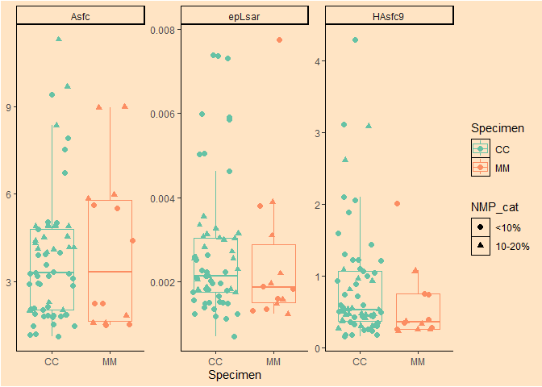
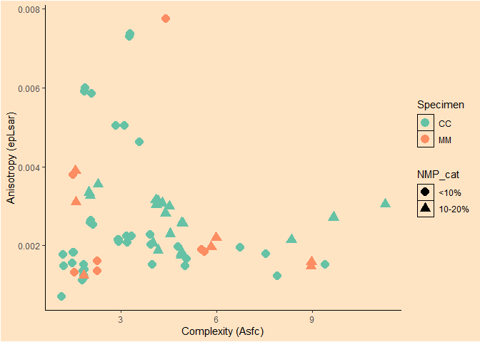

Plots of SSFA variables for the dataset of DMTA on Devionan sharks
================
Ivan Calandra
2023-06-13 09:55:28

- <a href="#goal-of-the-script" id="toc-goal-of-the-script">Goal of the
  script</a>
- <a href="#load-packages" id="toc-load-packages">Load packages</a>
- <a href="#read-in-data" id="toc-read-in-data">Read in data</a>
  - <a href="#get-name-and-path-of-input-file"
    id="toc-get-name-and-path-of-input-file">Get name and path of input
    file</a>
  - <a href="#read-in-rbin-file" id="toc-read-in-rbin-file">Read in Rbin
    file</a>
- <a href="#define-variables" id="toc-define-variables">Define
  variables</a>
- <a href="#exclude-surfaces-with-nmp--20"
  id="toc-exclude-surfaces-with-nmp--20">Exclude surfaces with NMP ≥
  20%</a>
- <a href="#plot-each-surface-parameter-in-a-boxplot"
  id="toc-plot-each-surface-parameter-in-a-boxplot">Plot each surface
  parameter in a boxplot</a>
  - <a href="#pivot-to-longer-format-for-facet-plots"
    id="toc-pivot-to-longer-format-for-facet-plots">Pivot to longer format
    for facet plots</a>
  - <a href="#plot" id="toc-plot">Plot</a>
  - <a href="#save-plot" id="toc-save-plot">Save plot</a>
- <a href="#plot-anisotropy-vs-complexity"
  id="toc-plot-anisotropy-vs-complexity">Plot anisotropy
  vs. complexity</a>
  - <a href="#plot-1" id="toc-plot-1">Plot</a>
  - <a href="#save-plot-1" id="toc-save-plot-1">Save plot</a>
- <a href="#sessioninfo-and-rstudio-version"
  id="toc-sessioninfo-and-rstudio-version">sessionInfo() and RStudio
  version</a>
- <a href="#cite-r-packages-used" id="toc-cite-r-packages-used">Cite R
  packages used</a>

------------------------------------------------------------------------

# Goal of the script

The script plots all SSFA variables for the Devonian shark dataset.

``` r
dir_in  <- "derived_data"
dir_out <- "plots"
```

Input Rbin data file must be located in “\~/derived_data”.  
Plots will be saved in “\~/plots”.

The knit directory for this script is the project directory.

------------------------------------------------------------------------

# Load packages

``` r
pack_to_load <- c("R.utils", "ggplot2", "RColorBrewer", "tidyverse")
sapply(pack_to_load, library, character.only = TRUE, logical.return = TRUE)
```

         R.utils      ggplot2 RColorBrewer    tidyverse 
            TRUE         TRUE         TRUE         TRUE 

------------------------------------------------------------------------

# Read in data

## Get name and path of input file

``` r
info_in <- list.files(dir_in, pattern = "\\.Rbin$", full.names = TRUE)
info_in
```

    [1] "derived_data/DMTAsharks_EAVP_100x.Rbin"

## Read in Rbin file

``` r
all_data <- loadObject(info_in)
str(all_data)
```

    'data.frame':   80 obs. of  12 variables:
     $ Species    : chr  "CC" "CC" "CC" "CC" ...
     $ Specimen   : chr  "A" "A" "A" "A" ...
     $ Location   : chr  "loc1" "loc1" "loc1" "loc2" ...
     $ Objective  : chr  "100x" "100x" "100x" "100x" ...
     $ Measurement: chr  "meas1" "meas2" "meas3" "meas1" ...
     $ NMP_cat    : Ord.factor w/ 3 levels "<10%"<"10-20%"<..: 1 1 1 1 1 1 2 2 2 1 ...
     $ NMP        : num  3.03 3.05 3.34 9.84 9.78 ...
     $ epLsar     : num  0.00119 0.00113 0.00124 0.00152 0.0018 ...
     $ NewEplsar  : num  0.0172 0.0172 0.0173 0.0176 0.0177 ...
     $ Asfc       : num  1.85 1.79 1.82 9.4 7.54 ...
     $ Smfc       : num  86.2 48.8 52 37.9 62.8 ...
     $ HAsfc9     : num  0.249 0.233 0.172 3.11 1.59 ...
     - attr(*, "comment")= Named chr [1:6] "%" "<no unit>" "<no unit>" "<no unit>" ...
      ..- attr(*, "names")= chr [1:6] "NMP" "epLsar" "NewEplsar" "Asfc" ...

------------------------------------------------------------------------

# Define variables

Here we define which columns are used for the plots.

``` r
# Combine columns species and specimen into one to be used to group on the x-axis
all_data[, "Species.Specimen"] <- paste(all_data[["Species"]], all_data[["Specimen"]], sep = ".")
x_var <- "Species.Specimen"

# Surface parameters to plot
y_var <- c("Asfc", "epLsar", "Smfc", "HAsfc9")

# colors
grp_colors <- "NMP_cat"

# shapes
grp_shapes <- "Location"
```

The following variables will be used:

``` r
x_var
```

    [1] "Species.Specimen"

``` r
y_var
```

    [1] "Asfc"   "epLsar" "Smfc"   "HAsfc9"

``` r
grp_colors
```

    [1] "NMP_cat"

``` r
grp_shapes
```

    [1] "Location"

------------------------------------------------------------------------

# Exclude surfaces with NMP ≥ 20%

Surfaces with more than 20% NMP should not be analyzed.

``` r
data_nmp0_20 <- filter(all_data, NMP_cat != "≥20%")
data_nmp0_20$NMP_cat <- factor(data_nmp0_20$NMP_cat)
str(data_nmp0_20)
```

    'data.frame':   75 obs. of  13 variables:
     $ Species         : chr  "CC" "CC" "CC" "CC" ...
     $ Specimen        : chr  "A" "A" "A" "A" ...
     $ Location        : chr  "loc1" "loc1" "loc1" "loc2" ...
     $ Objective       : chr  "100x" "100x" "100x" "100x" ...
     $ Measurement     : chr  "meas1" "meas2" "meas3" "meas1" ...
     $ NMP_cat         : Ord.factor w/ 2 levels "<10%"<"10-20%": 1 1 1 1 1 1 2 2 2 1 ...
     $ NMP             : num  3.03 3.05 3.34 9.84 9.78 ...
     $ epLsar          : num  0.00119 0.00113 0.00124 0.00152 0.0018 ...
     $ NewEplsar       : num  0.0172 0.0172 0.0173 0.0176 0.0177 ...
     $ Asfc            : num  1.85 1.79 1.82 9.4 7.54 ...
     $ Smfc            : num  86.2 48.8 52 37.9 62.8 ...
     $ HAsfc9          : num  0.249 0.233 0.172 3.11 1.59 ...
     $ Species.Specimen: chr  "CC.A" "CC.A" "CC.A" "CC.A" ...
     - attr(*, "comment")= Named chr [1:6] "%" "<no unit>" "<no unit>" "<no unit>" ...
      ..- attr(*, "names")= chr [1:6] "NMP" "epLsar" "NewEplsar" "Asfc" ...

------------------------------------------------------------------------

# Plot each surface parameter in a boxplot

## Pivot to longer format for facet plots

``` r
data_long <- select(data_nmp0_20, all_of(c(x_var, y_var, grp_colors, grp_shapes))) %>%
             pivot_longer(all_of(y_var), names_to = "parameter", values_to = "value")
```

## Plot

``` r
# set up plot
p_box <- ggplot(data_long, aes_string(x = x_var, y = "value")) +

         # Boxplots:
         # hide outliers (all points are shown with geom_point() below) 
         geom_boxplot(outlier.shape = NA) +
  
         # Points:
         # Add layers of shapes and colors for points 
         # Jitter points
         geom_point(mapping = aes_string(color = grp_colors, shape = grp_shapes), position = "jitter", size = 2) +
  
         # Remove y-axis label
         labs(y = NULL) + 
  
         # Choose a light theme
         theme_classic() +
  
         # Wrap around parameters with free y-scales
         facet_wrap(~ parameter, scales = "free_y") +

         # The qualitative 'Set2' palette of RColorBrewer is colorblind friendly and has 8 colors
         scale_color_brewer(palette = 'Set2')
```

    Warning: `aes_string()` was deprecated in ggplot2 3.0.0.
    ℹ Please use tidy evaluation ideoms with `aes()`

``` r
# Print plot
print(p_box)
```

<!-- -->

## Save plot

``` r
ggsave(plot = p_box, filename = "DMTAsharks_EAVP_100x_SSFAboxplots.pdf", 
       path = dir_out, width = 240, height = 190, units = "mm")
```

------------------------------------------------------------------------

# Plot anisotropy vs. complexity

## Plot

``` r
# set up plot
p_bi <- ggplot(data_nmp0_20, aes(x = Asfc, y = epLsar)) +
        
        # Scatterplot
        geom_point(mapping = aes_string(color = x_var), size = 4) +
  
        # Adjust axes labels
        labs(x = "Complexity (Asfc)", y = "Anisotropy (epLsar)") +
  
        # The qualitative 'Set1' palette of RColorBrewer is colorblind friendly and has 9 colors
        scale_color_brewer(palette = 'Set1') +
  
        # Choose a light theme
        theme_classic()

# Print plot
print(p_bi)
```

<!-- -->

## Save plot

``` r
ggsave(plot = p_bi, filename = "DMTAsharks_EAVP_100x_epLsar-Asfc.pdf", 
       path = dir_out, width = 240, height = 190, units = "mm")
```

------------------------------------------------------------------------

# sessionInfo() and RStudio version

``` r
sessionInfo()
```

    R version 4.2.2 (2022-10-31 ucrt)
    Platform: x86_64-w64-mingw32/x64 (64-bit)
    Running under: Windows 10 x64 (build 19043)

    Matrix products: default

    locale:
    [1] LC_COLLATE=English_United States.utf8 
    [2] LC_CTYPE=English_United States.utf8   
    [3] LC_MONETARY=English_United States.utf8
    [4] LC_NUMERIC=C                          
    [5] LC_TIME=English_United States.utf8    

    attached base packages:
    [1] stats     graphics  grDevices utils     datasets  methods   base     

    other attached packages:
     [1] lubridate_1.9.2    forcats_1.0.0      stringr_1.5.0      dplyr_1.1.0       
     [5] purrr_1.0.1        readr_2.1.4        tidyr_1.3.0        tibble_3.1.8      
     [9] tidyverse_2.0.0    RColorBrewer_1.1-3 ggplot2_3.4.1      R.utils_2.12.2    
    [13] R.oo_1.25.0        R.methodsS3_1.8.2 

    loaded via a namespace (and not attached):
     [1] highr_0.10        pillar_1.8.1      compiler_4.2.2    tools_4.2.2      
     [5] digest_0.6.31     timechange_0.2.0  evaluate_0.20     lifecycle_1.0.3  
     [9] gtable_0.3.1      pkgconfig_2.0.3   rlang_1.0.6       cli_3.6.0        
    [13] rstudioapi_0.14   yaml_2.3.7        xfun_0.37         fastmap_1.1.1    
    [17] withr_2.5.0       knitr_1.42        systemfonts_1.0.4 hms_1.1.2        
    [21] generics_0.1.3    vctrs_0.5.2       rprojroot_2.0.3   grid_4.2.2       
    [25] tidyselect_1.2.0  glue_1.6.2        R6_2.5.1          textshaping_0.3.6
    [29] fansi_1.0.4       rmarkdown_2.20    farver_2.1.1      tzdb_0.3.0       
    [33] magrittr_2.0.3    ellipsis_0.3.2    scales_1.2.1      htmltools_0.5.4  
    [37] colorspace_2.1-0  ragg_1.2.5        labeling_0.4.2    utf8_1.2.3       
    [41] stringi_1.7.12    munsell_0.5.0    

RStudio version 2023.3.0.386.

------------------------------------------------------------------------

# Cite R packages used

Does not work yet

------------------------------------------------------------------------

END OF SCRIPT
